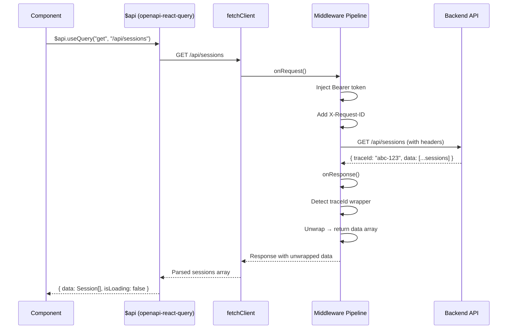
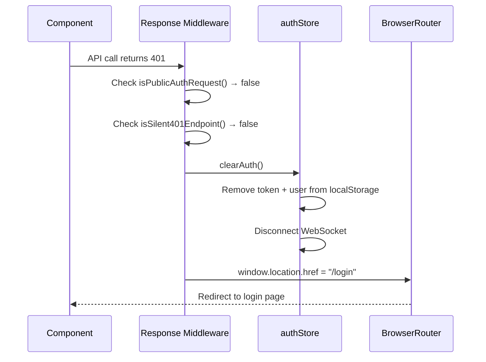
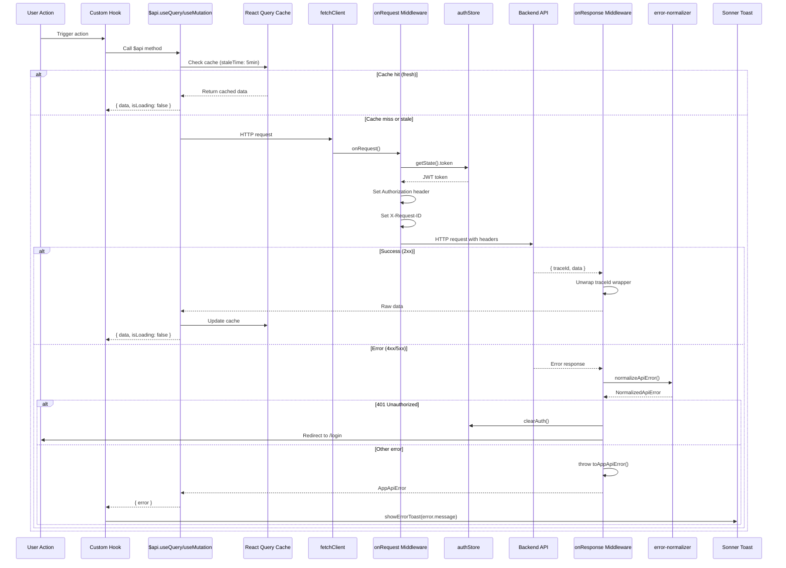

# 02 — API & Data Fetching Layer

> **Core libraries:** `openapi-fetch` · `openapi-react-query` · `@tanstack/react-query`  
> **Schema source:** `schema-from-be.d.ts` (auto-generated from OpenAPI spec)  
> **Last Synced:** 2026-06-05

---

## 1. Architecture Overview

The API layer is built on a **three-tier architecture**:

```
┌─────────────────────────────────────────────────────────────────┐
│                     COMPONENT / HOOK LAYER                       │
│  $api.useQuery("get", "/api/sessions")                          │
│  $api.useMutation("post", "/api/sessions")                      │
└────────────────────────────┬────────────────────────────────────┘
                             │
┌────────────────────────────▼────────────────────────────────────┐
│                  openapi-react-query ($api)                     │
│  Bridges openapi-fetch with React Query hooks                   │
│  Auto-inferred types from schema-from-be.d.ts                  │
└────────────────────────────┬────────────────────────────────────┘
                             │
┌────────────────────────────▼────────────────────────────────────┐
│                    openapi-fetch (fetchClient)                   │
│  Middleware: JWT injection, traceId unwrapping, error handling  │
│  Base URL: VITE_API_BASE_URL (default: https://api.kdz.asia)   │
└────────────────────────────┬────────────────────────────────────┘
                             │
                    ┌────────▼────────┐
                    │   Spring Boot   │
                    │   Backend API   │
                    │  /v3/api-docs   │
                    └─────────────────┘
```

### Why This Architecture?

1. **Type Safety End-to-End**: The backend OpenAPI spec → `schema-from-be.d.ts` → `openapi-fetch` provides compile-time type checking for every API call. Typos in endpoint paths or wrong parameter types are caught at build time.

2. **Zero Manual Type Definitions**: Request/response types are auto-generated from the backend contract. No hand-maintained TypeScript interfaces for API payloads.

3. **React Query Integration**: `openapi-react-query` wraps `openapi-fetch` with React Query hooks (`useQuery`, `useMutation`), providing caching, deduplication, and background refetching out of the box.

4. **Centralized Middleware**: Cross-cutting concerns (auth tokens, error normalization, response unwrapping) are handled once in the fetch middleware, not duplicated across components.

---

## 2. Schema Generation

### 2.1 — The Contract File

```typescript
// schema-from-be.d.ts — AUTO-GENERATED, DO NOT EDIT
// Generated from: https://api.kdz.asia/v3/api-docs
// Command: pnpm generate-schema
```

This file contains all TypeScript types derived from the backend's OpenAPI 3.0 specification. It exports:

- **`paths`** — All API endpoints with their method, parameters, request body, and response types
- **`components["schemas"]`** — All data models (User, Session, Payment, etc.)

### 2.2 — Generation Command

```bash
pnpm generate-schema
```

Which expands to:

```bash
pnpm exec dotenv -e .env -- pnpm exec openapi-typescript %VITE_API_BASE_URL%/v3/api-docs -o ./schema-from-be.d.ts
```

**Key details:**

- Uses `dotenv-cli` to load `.env` for `VITE_API_BASE_URL`
- Uses `openapi-typescript` v7 to generate TypeScript from OpenAPI JSON
- Output goes to `schema-from-be.d.ts` at the project root
- This runs **automatically on pre-commit** (Husky hook) and **before `pnpm dev`** (Nx dependency)

### 2.3 — How Types Flow

```typescript
// schema-from-be.d.ts exports:
export type paths = { ... };           // All endpoint definitions
export type components = {             // All data models
  schemas: {
    User: { id: string; email: string; ... };
    Session: { ... };
    Payment: { ... };
    // ... hundreds of types
  };
};

// In api.ts, the fetch client is typed:
import type { paths } from "../../schema-from-be";
const fetchClient = createFetchClient<paths>({ baseUrl: API_BASE_URL });

// This means every API call is fully typed:
$api.useQuery("get", "/api/sessions");
// TypeScript knows the response type is paths["/api/sessions"]["get"]["responses"]["200"]
```

---

## 3. The `$api` Client (Primary — Use for All New Code)

### 3.1 — Client Creation

```typescript
// src/lib/api.ts
import createFetchClient from "openapi-fetch";
import createClient from "openapi-react-query";
import type { paths } from "../../schema-from-be";

const fetchClient = createFetchClient<paths>({
  baseUrl: API_BASE_URL,
  // 90-second global timeout (critical for slow AI API responses)
  fetch: async (request: Request) => {
    let signal = request.signal;
    if (!signal && typeof AbortSignal.timeout === "function") {
      signal = AbortSignal.timeout(90000);
    }
    const newRequest = new Request(request, { signal });
    return fetch(newRequest);
  },
});

export const $api = createClient(fetchClient);
```

### 3.2 — Usage Patterns

**Queries (GET requests):**

```typescript
// Simple query
const { data, isLoading, error } = $api.useQuery("get", "/api/sessions");

// Query with path parameters
const { data } = $api.useQuery("get", "/api/sessions/{id}", {
  params: { path: { id: sessionId } },
});

// Query with query parameters
const { data } = $api.useQuery("get", "/api/users", {
  params: { query: { page: 1, limit: 10, sortBy: "createdAt" } },
});
```

**Mutations (POST/PUT/DELETE requests):**

```typescript
const createSession = $api.useMutation("post", "/api/sessions");

const handleCreate = () => {
  createSession.mutate({
    body: {
      mentorId: "123",
      scheduledAt: "2026-06-10T10:00:00",
      type: "MOCK_INTERVIEW",
    },
  });
};
```

**Query Invalidation (after mutations):**

```typescript
import { queryClient } from "@/lib/queryClient";

// After a successful mutation, invalidate related queries
queryClient.invalidateQueries({ queryKey: ["get", "/api/sessions"] });

// Openapi-react-query uses ["method", "/path"] format for query keys
```

### 3.3 — Type Inference Examples

```typescript
// The response type is fully inferred from schema-from-be.d.ts
const { data } = $api.useQuery("get", "/api/sessions/{id}", {
  params: { path: { id: "123" } },
});

// data is typed as the response body from the OpenAPI spec
// Access nested properties with full type safety
data?.sessionStatus; // TypeScript knows this is a SessionStatus enum
data?.mentor?.fullName; // TypeScript knows Mentor has a fullName field
```

---

## 4. Fetch Middleware Pipeline

The `fetchClient` uses openapi-fetch's middleware system to intercept every request and response:

### 4.1 — Request Middleware

```typescript
fetchClient.use({
  async onRequest({ request }) {
    // 1. JWT Token Injection
    const { useAuthStore } = await import("@/stores/authStore");
    const token = useAuthStore.getState().token;
    const shouldSkipAuthHeader = isPublicAuthRequest(request.url, request.method);

    if (token && !shouldSkipAuthHeader) {
      request.headers.set("Authorization", `Bearer ${token}`);
    }

    // 2. Request ID Generation (for debugging)
    const requestId = `${Date.now()}-${Math.random().toString(36).substring(2, 11)}`;
    request.headers.set("X-Request-ID", requestId);

    // 3. Development Logging
    if (import.meta.env.DEV) {
      console.log("🚀 API Request:", { method, url, headers, timestamp });
    }

    return request;
  },
});
```

**Key decisions:**

- **Dynamic import** of `useAuthStore` prevents circular dependency issues
- **`isPublicAuthRequest()`** skips auth header for login, signup, and public GET endpoints
- **`X-Request-ID`** helps trace requests through the backend for debugging

### 4.1.1 — `isPublicAuthRequest()` Deep Dive

The function uses **three tiers** of matching to decide if auth should be skipped:

```typescript
// src/constants/api.config.ts
export const isPublicAuthRequest = (url?: string, method?: string): boolean => {
  const normalizedMethod = (method || "get").toLowerCase();
  const requestPath = normalizeRequestPath(url);

  // Tier 1: Public GET endpoints (no auth needed)
  if (normalizedMethod === "get") {
    if (PUBLIC_GET_ENDPOINTS.has(requestPath)) return true; // exact match
    if (PUBLIC_GET_ENDPOINT_PATTERNS.some((p) => p.test(requestPath))) return true; // regex
  }

  // Tier 2: Auth POST endpoints (login, signup, OAuth)
  if (normalizedMethod !== "post") return false;
  if (PUBLIC_AUTH_POST_ENDPOINTS.has(requestPath)) return true;

  // Tier 3: Registration POST endpoints (only on public auth pages)
  if (PUBLIC_REGISTRATION_POST_ENDPOINTS.has(requestPath)) {
    return isPublicAuthPage(); // checks window.location.pathname
  }

  return false;
};
```

**Endpoint classification tables:**

| Exact Match POST Endpoints    | Purpose              |
| ----------------------------- | -------------------- |
| `/api/auth/login`             | Email/password login |
| `/api/auth/login-with-google` | Google OAuth login   |
| `/auth/signup`                | User registration    |
| `/auth/mentor-register`       | Mentor registration  |

| Exact Match GET Endpoints | Purpose             |
| ------------------------- | ------------------- |
| `/api/posts/published`    | Public blog feed    |
| `/api/companies`          | Public company list |

| GET Regex Patterns                             | Purpose                |
| ---------------------------------------------- | ---------------------- |
| `/^\/api\/posts\/[^/]+$/`                      | Individual public post |
| `/^\/api\/posts\/likes\/[^/]+\/check\/[^/]+$/` | Like status check      |
| `/^\/api\/posts/`                              | Any posts endpoint     |

| Registration POST (Page-Gated) | Condition                                             |
| ------------------------------ | ----------------------------------------------------- |
| `/api/users` (create user)     | Only on `/signup`, `/mentor-register`, `/select-role` |
| `/api/mentors` (create mentor) | Only on `/signup`, `/mentor-register`, `/select-role` |

### 4.1.2 — `isSilent401Endpoint()` Deep Dive

Some endpoints legitimately return 401 without indicating an expired session. The silent handler **skips** the auto-logout redirect:

```typescript
export const isSilent401Endpoint = (url?: string, method?: string): boolean => {
  const normalizedMethod = (method || "get").toLowerCase();
  if (normalizedMethod !== "get") return false; // Only GETs can be silent

  const requestPath = normalizeRequestPath(url);
  if (SILENT_401_ENDPOINTS.has(requestPath)) return true; // exact
  if (SILENT_401_ENDPOINT_PATTERNS.some((p) => p.test(requestPath))) return true; // regex
  return false;
};
```

**Silent 401 endpoints:**

| Endpoint                   | Reason                                               |
| -------------------------- | ---------------------------------------------------- |
| `GET /api/posts/published` | Public feed — 401 means unauthenticated, not expired |
| `GET /api/posts/{postId}`  | Public post detail — same rationale                  |

### 4.1.3 — Posts GET 401 Exception

A **third exception** exists specifically in the response middleware for the posts GET pattern:

```typescript
// Inside onResponse error handler:
if (response.status === 401) {
  const isPostsEndpoint = requestUrl.includes("/posts") && requestMethod.toLowerCase() === "get";

  if (!shouldSkipRedirect && !shouldSilentFail && !isPostsEndpoint) {
    useAuthStore.getState().clearAuth();
    window.location.href = "/login";
  }
  // isPostsEndpoint → no redirect, no logout
}
```

This triple-guard (`shouldSkipRedirect || shouldSilentFail || isPostsEndpoint`) ensures that browsing the community feed never triggers an unwanted redirect to `/login`, even if the user is not authenticated or their token is invalid.

### 4.2 — Response Middleware

```typescript
fetchClient.use({
  async onResponse({ request, response }) {
    // 1. JSON Parsing
    const contentType = response.headers.get("content-type");
    if (contentType?.includes("application/json")) {
      payload = await response.clone().json();
    }

    if (response.ok) {
      // 2. TraceId Unwrapping
      // Backend wraps responses as { traceId, data }
      // Middleware unwraps to return just `data`
      if (hasJson && payload && typeof payload === "object") {
        if ("traceId" in (payload as Record<string, unknown>)) {
          const record = payload as Record<string, unknown>;
          let unwrappedPayload: unknown = payload;
          const keys = Object.keys(record);

          // Case 1: Standard wrapper { traceId, data } — extract data directly
          if (
            keys.includes("data") &&
            (keys.length === 2 || (keys.length === 1 && !keys.includes("traceId")))
          ) {
            unwrappedPayload = record["data"];
          } else {
            // Case 2: Non-standard wrapper — strip traceId, keep all other fields
            unwrappedPayload = Object.fromEntries(
              Object.entries(record).filter(([k]) => k !== "traceId")
            );
          }

          // Create new response with unwrapped body
          finalResponse = new Response(JSON.stringify(unwrappedPayload), ...);
        }
      }
    } else {
      // 3. Error Normalization
      const normalizedError = normalizeApiError(errorDescriptor, fallbackMessage);

      // 4. Auto-Logout on 401
      if (response.status === 401) {
        if (!shouldSkipRedirect && !shouldSilentFail) {
          useAuthStore.getState().clearAuth();
          window.location.href = "/login";
        }
      }

      // 5. Throw Normalized Error
      throw toAppApiError(errorDescriptor, normalizedError.message);
    }

    return finalResponse;
  },
});
```

### 4.3 — Response Unwrapping Diagram



---

## 5. Error Handling Pipeline

### 5.1 — Error Normalization (`lib/error-normalizer.ts`)

Every API error is normalized into a consistent shape:

```typescript
export interface NormalizedApiError extends ApiError {
  message: string; // User-friendly Vietnamese message
  rawMessage?: string; // Original backend error message
  status?: number; // HTTP status code
  code?: string; // Application error code
  traceId?: string; // Backend trace ID for debugging
  fieldErrors?: Record<string, string>; // Per-field validation errors
  source: ErrorSource; // "axios" | "fetch" | "native" | "unknown"
  payload?: unknown; // Raw response payload
}
```

### 5.2 — Error Message Resolution Priority

The normalizer resolves error messages in this priority order:

```
1. Known pattern match (regex)     → "Wrong password" / "Email already exists"
2. Raw message from payload        → Backend's specific error message
3. HTTP status code mapping        → "Login session expired" (401)
4. Fallback message                → "An error has occurred"
```

**Known error patterns** (Vietnamese-aware):

| Pattern                                    | Message (i18n key)                        |
| ------------------------------------------ | ----------------------------------------- |
| `bad credentials`, `invalid password`      | `general.wrongPassword1`                  |
| `user not found`, `email không tồn tại`    | `general.wrongEmail`                      |
| `email đã tồn tại`, `email already exists` | `general.emailAlreadyExists`              |
| `insufficient balance`, `số dư không đủ`   | `general.walletBalanceIsNotEnough`        |
| `no enum constant`, `json parse error`     | `general.theDataSubmittedIsInvalid`       |
| `timed out`, `timeout`                     | `general.requestTimeoutExceededPleaseTry` |

**HTTP Status Code Messages:**

| Status | Message (i18n key)                          |
| ------ | ------------------------------------------- |
| 400    | `general.invalidDataPleaseCheckAgain`       |
| 401    | `general.loginSessionExpiredPleaseLog`      |
| 403    | `general.youDoNotHavePermission`            |
| 404    | `general.requestedDataNotFound`             |
| 409    | `general.conflictingDataPleaseTryAgain`     |
| 413    | `general.fileIsTooLargePlease`              |
| 422    | `general.invalidDataPleaseCheckAgain`       |
| 429    | `general.tooManyRequestsPleaseTry`          |
| 500    | `general.theSystemIsExperiencingProblems`   |
| 502    | `general.theServerIsTemporarilyUnavailable` |
| 503    | `general.serviceIsUnderMaintenancePlease`   |
| 504    | `general.theServerRespondsTooSlowly`        |

### 5.2.1 — Complete `normalizeApiError()` → `toAppApiError()` Chain

The error normalization is a two-stage pipeline. First, `normalizeApiError()` extracts all error data from any error shape. Then, `toAppApiError()` wraps the normalized data into an `Error` subclass with structured properties:

```typescript
export const normalizeApiError = (error: unknown, fallbackMessage?: string): NormalizedApiError => {
  const { payload, source } = extractPayload(error); // detects axios / fetch / native / unknown
  const status = extractStatus(error); // tries .status, .statusCode, .response.status
  const traceId = extractTraceId(error, payload); // from payload or error object
  const code = extractCode(error, payload); // from payload.code or error.code
  const fieldErrors = extractFieldErrors(payload); // from payload.fieldErrors or payload.errors

  // Priority: known regex patterns → raw payload message → status code → fallback
  const rawMessage = extractMessageFromPayload(payload);
  const mappedMessage = mapKnownMessage(rawMessage);
  const statusMessage = resolveStatusErrorMessage(status);
  const message = mappedMessage || rawMessage || statusMessage || fallbackMessage;

  return { message, rawMessage, status, code, traceId, fieldErrors, source, payload };
};

export const toAppApiError = (error: unknown, fallbackMessage?: string): AppApiError => {
  const normalized = normalizeApiError(error, fallbackMessage);
  const appError = new Error(normalized.message) as AppApiError;
  appError.status = normalized.status;
  appError.code = normalized.code;
  appError.traceId = normalized.traceId;
  appError.rawMessage = normalized.rawMessage;
  appError.source = normalized.source;
  appError.fieldErrors = normalized.fieldErrors;
  appError.payload = normalized.payload;
  return appError;
};
```

**`extractPayload()` detection logic:** The function determines the error source based on the shape of the error object:

| Error Shape              | Source      | Payload         |
| ------------------------ | ----------- | --------------- |
| `{ response: { data } }` | `"axios"`   | `response.data` |
| `{ data }`               | `"fetch"`   | `error.data`    |
| `Error` instance         | `"native"`  | `error.message` |
| anything else            | `"unknown"` | raw error value |

This means both old Axios-style errors and new `fetchClient` errors are handled by the same normalization pipeline.

### 5.2.2 — Deep Payload Message Extraction

The `extractMessageFromPayload()` function recursively searches the error response for a human-readable message, checking up to 4 levels deep:

```
payload.message → payload.error → payload.detail → payload.title
→ payload.msg → payload.reason → payload.description
→ payload.data.message (recursive)
→ payload.errors (field errors, first value)
→ payload.fieldErrors (field errors, first value)
```

### 5.4 — 401 Auto-Logout Flow



**Silent 401 endpoints** (not logged out on 401):

- GET requests to public or semi-public endpoints that may return 401 without indicating an expired session

---

## 6. React Query Configuration

### 6.1 — QueryClient Setup

```typescript
// src/lib/queryClient.ts
export const queryClient = new QueryClient({
  defaultOptions: {
    queries: {
      retry: 3, // Retry up to 3 times
      retryDelay: (attemptIndex) => Math.min(1000 * 2 ** attemptIndex, 30000), // Exponential backoff: 1s, 2s, 4s, max 30s
      staleTime: 5 * 60 * 1000, // Data fresh for 5 minutes
      gcTime: 10 * 60 * 1000, // Cache garbage collected after 10 minutes
      refetchOnWindowFocus: false, // No automatic refetch on tab focus
    },
    mutations: {
      retry: 1, // Mutations retry only once
    },
  },
});
```

### 6.2 — Provider Setup

```typescript
// src/contexts/QueryProvider.tsx
export function QueryProvider({ children }: QueryProviderProps) {
  return (
    <QueryClientProvider client={queryClient}>
      {children}
    </QueryClientProvider>
  );
}
```

The `QueryProvider` wraps the entire app in `App.tsx`, making React Query available everywhere.

### 6.3 — Query Key Convention

`openapi-react-query` uses `["method", "/path"]` as the canonical query key format:

```typescript
// Reading query keys
queryClient.invalidateQueries({ queryKey: ["get", "/api/sessions"] });
queryClient.invalidateQueries({ queryKey: ["get", "/api/sessions/{id}"] });

// Prefetching
queryClient.prefetchQuery({
  queryKey: ["get", "/api/users"],
  queryFn: () => $api.fetch("get", "/api/users"),
});
```

---

## 7. The `useMutationHandler` Hook

A custom wrapper around `useMutation` that provides automatic toast notifications with i18n-aware messages:

```typescript
// src/hooks/useMutationHandler.ts
export function useMutationHandler<TData, TVariables, TError>({
  mutationFn,
  onSuccess,
  onError,
  successMessage,
  errorMessage,
  showSuccessToast = true, // Default: true
  showErrorToast = true, // Default: true
  ...options // Pass-through to useMutation
}: UseMutationHandlerConfig<TData, TVariables, TError>) {
  return useMutation({
    mutationFn,
    onSuccess: (data, variables) => {
      // 1. Extract message from response or use provided successMessage
      let message = successMessage;
      if (!message && typeof data === "object" && data !== null) {
        const response = data as Record<string, unknown>;
        message =
          (response.message as string) ||
          (response.msg as string) ||
          t("general.theOperationHasCompletedSuccessfully");
      }

      // 2. Show success toast via sonner
      if (showSuccessToast && message) {
        toast.success(t("general.success"), { description: message });
      }

      // 3. Call custom success handler
      if (onSuccess) onSuccess(data, variables);
    },
    onError: (error, variables) => {
      // 1. Normalize error message through error-normalizer pipeline
      const message = getNormalizedErrorMessage(
        error,
        errorMessage || t("general.anErrorHasOccurredPlease")
      );

      // 2. Show error toast via sonner
      if (showErrorToast) {
        toast.error(t("common.error"), { description: message });
      }

      // 3. Call custom error handler
      if (onError) onError(error, variables);
    },
    ...options,
  });
}
```

**How messages flow:**

1. **Success**: The hook first tries `successMessage` prop → then extracts `data.message` / `data.msg` → then falls back to i18n `general.theOperationHasCompletedSuccessfully`
2. **Error**: Calls `getNormalizedErrorMessage()` which runs the full `normalizeApiError()` pipeline (known patterns → payload message → status code → fallback)
3. **Toast rendering**: Success shows a green toast with title "Thành công"; error shows a red toast with title "Lỗi"

**Usage patterns:**

```typescript
// Pattern 1: Simple — let messages auto-extract
const createSession = useMutationHandler({
  mutationFn: (body) => $api.fetch("post", "/api/sessions", { body }),
});

// Pattern 2: Custom messages + callbacks
const deleteItem = useMutationHandler({
  mutationFn: (id) => $api.fetch("delete", "/api/items/{id}", { params: { path: { id } } }),
  successMessage: t("item.deleteSuccess"), // "Xóa thành công"
  errorMessage: t("item.deleteFailed"), // "Xóa thất bại"
  onSuccess: () => queryClient.invalidateQueries({ queryKey: ["get", "/api/items"] }),
  showErrorToast: true,
});

// Pattern 3: Suppress toasts (handle manually)
const login = useMutationHandler({
  mutationFn: authManager.login,
  showSuccessToast: false, // LoginPage handles navigation itself
  showErrorToast: false, // Form displays error inline
});
```

---

## 8. Legacy Service Managers (Backwards Compatibility)

### 8.1 — Architecture

```typescript
// src/services/auth.manager.ts
import { fetchClient } from "@/lib/api";

class AuthManager {
  async login(payload: LoginPayload): Promise<ApiResponse<LoginResponse>> {
    const response = await fetchClient.POST("/api/auth/login", { body: payload });
    // Manual error handling and response transformation
  }
}

export const authManager = new AuthManager();
```

### 8.2 — Migration Status

Service managers have been **fully migrated from Axios to `fetchClient`** under the hood. They use the same `fetchClient` from `src/lib/api.ts`, which means they benefit from the same middleware (JWT injection, error normalization, etc.).

**However**, for **new code**, always prefer `$api` directly:

```typescript
// ❌ Legacy pattern (still works, but avoid for new code)
import { sessionManager } from "@/services";
const sessions = await sessionManager.getAll();

// ✅ Preferred pattern (new code)
const { data: sessions } = $api.useQuery("get", "/api/sessions");
```

### 8.3 — Complete Manager List

| Manager File                    | Purpose                                   |
| ------------------------------- | ----------------------------------------- |
| `auth.manager.ts`               | Login, signup, OAuth, mentor registration |
| `session.manager.ts`            | Interview session CRUD                    |
| `mentor.manager.ts`             | Mentor profile management                 |
| `user.manager.ts`               | User profile management                   |
| `users-admin.manager.ts`        | Admin user management                     |
| `payment.manager.ts`            | Payment processing                        |
| `notification.manager.ts`       | Notification CRUD                         |
| `post.manager.ts`               | Social post CRUD                          |
| `chat.manager.ts`               | Chat messages                             |
| `company.manager.ts`            | Company management                        |
| `job-description.manager.ts`    | Job description CRUD                      |
| `application.manager.ts`        | Job applications                          |
| `practice-set.manager.ts`       | Practice set management                   |
| `practice-set-item.manager.ts`  | Practice set items                        |
| `quiz-set.manager.ts`           | Quiz management                           |
| `question.manager.ts`           | Question CRUD                             |
| `question-category.manager.ts`  | Question categories                       |
| `question-major.manager.ts`     | Question majors                           |
| `round.manager.ts`              | Interview rounds                          |
| `interview-session.manager.ts`  | AI interview sessions                     |
| `interview-analysis.manager.ts` | Interview analysis                        |
| `mentor-feedback.manager.ts`    | Mentor feedback                           |
| `mentor-review.manager.ts`      | Mentor reviews                            |
| `candidate-profile.manager.ts`  | Candidate profiles                        |
| `dashboard-admin.manager.ts`    | Admin dashboard stats                     |
| `socket.manager.ts`             | WebSocket (STOMP/SockJS)                  |

---

## 9. API Endpoints Reference

### 9.1 — Endpoint Constants (`constants/api.config.ts`)

All endpoints are defined in a centralized `API_ENDPOINTS` object:

```typescript
export const API_ENDPOINTS = {
  AUTH: {
    LOGIN: "/api/auth/login",
    LOGIN_WITH_GOOGLE: "/api/auth/login-with-google",
    SIGNUP: "/auth/signup",
    LOGOUT: "/auth/logout",
    REFRESH: "/auth/refresh",
    MENTOR_REGISTER: "/auth/mentor-register",
    CHECK_STATUS: "/auth/mentor-status",
  },
  SESSIONS: {
    LIST: "/api/sessions",
    DETAIL: "/api/sessions/:id",
    CREATE: "/api/sessions/create-session",
    UPDATE: "/api/sessions",
    JOIN: "/api/sessions/join-session",
    MAKE_PAYMENT: "/api/sessions/make-payment",
  },
  // ... 20+ endpoint groups
};
```

### 9.2 — `buildEndpoint()` Helper

Substitutes `:param` placeholders in endpoint paths:

```typescript
import { buildEndpoint, API_ENDPOINTS } from "@/constants/api.config";

const url = buildEndpoint(API_ENDPOINTS.SESSIONS.DETAIL, { id: 123 });
// Result: "/api/sessions/123"

const url2 = buildEndpoint(API_ENDPOINTS.USERS.DETAIL, { id: "user-456" });
// Result: "/api/users/user-456"
```

### 9.3 — Public vs. Protected Endpoints

The middleware distinguishes between public and protected endpoints:

```typescript
// Public POST endpoints (no auth header needed):
const PUBLIC_AUTH_POST_ENDPOINTS = new Set([
  API_ENDPOINTS.AUTH.LOGIN,
  API_ENDPOINTS.AUTH.LOGIN_WITH_GOOGLE,
  API_ENDPOINTS.AUTH.SIGNUP,
  API_ENDPOINTS.AUTH.MENTOR_REGISTER,
]);

// Public GET endpoints (no auth header needed):
const PUBLIC_GET_ENDPOINTS = new Set([
  API_ENDPOINTS.QUESTION.LIST,
  API_ENDPOINTS.QUESTION_CATEGORIES.LIST,
  API_ENDPOINTS.QUESTION_MAJORS.LIST,
  API_ENDPOINTS.POSTS.PUBLISHED,
  API_ENDPOINTS.COMPANIES.LIST,
  API_ENDPOINTS.JOB_DESCRIPTIONS.LIST,
  API_ENDPOINTS.MEMBERSHIP_PLANS.LIST,
  // ... more public GET endpoints
]);
```

### 9.4 — Endpoint Groups Summary

| Group                 | Endpoints | Purpose                          |
| --------------------- | --------- | -------------------------------- |
| `AUTH`                | 7         | Authentication & registration    |
| `USER`                | 7         | Current user profile + settings  |
| `USERS`               | 6         | Admin user management            |
| `MENTOR`              | 5         | Mentor CRUD                      |
| `DASHBOARD`           | 6         | Admin dashboard stats            |
| `SESSIONS`            | 8         | Interview sessions               |
| `PAYMENTS`            | 5         | Payment processing               |
| `AI_INTERVIEW`        | 5         | AI interview sessions            |
| `MOCK_INTERVIEW`      | 5         | Mock interview sessions          |
| `CHAT`                | 7         | Chat messages                    |
| `MESSAGES`            | 2         | Messenger contacts/history       |
| `QUESTION`            | 8         | Practice questions               |
| `QUESTION_CATEGORIES` | 5         | Question categories              |
| `QUESTION_MAJORS`     | 5         | Question majors (at /api/majors) |
| `PRACTICE_SETS`       | 11        | Practice sets + AI generation    |
| `PRACTICE_SET_ITEMS`  | 7         | Practice set items               |
| `QUIZ_SETS`           | 9         | Quiz sets + AI generation        |
| `MEMBERSHIP_PLANS`    | 5         | Membership plan management       |
| `NOTIFICATIONS`       | 3         | Notifications                    |
| `MENTOR_REVIEWS`      | 4         | Mentor reviews                   |
| `MENTOR_FEEDBACKS`    | 5         | Mentor feedback                  |
| `CANDIDATE_PROFILES`  | 4         | Candidate profiles               |
| `POSTS`               | 18        | Social posts + comments + likes  |
| `COMPANIES`           | 5         | Company management               |
| `JOB_DESCRIPTIONS`    | 7         | Job descriptions                 |
| `ROUNDS`              | 2         | Interview rounds                 |
| `APPLICATIONS`        | 4         | Job applications                 |
| `INTERVIEW_SESSIONS`  | 6         | AI interview sessions            |
| `INTERVIEW_ANALYSIS`  | 1         | Face behavior analysis           |
| `PROCTORING`          | 1         | Proctoring tracking              |
| `INTERVIEW_V1`        | 2         | V1 interview flow                |

**Total: 31 endpoint groups, ~168 individual endpoints**

---

## 10. Complete Request Lifecycle Diagram



---

## 11. Authentication Flow

### 11.1 — JWT Token Lifecycle

```mermaid
flowchart TD
    A[User enters credentials] --> B[POST /api/auth/login]
    B --> C{Response}
    C -->|Success| D[Extract token + user from response]
    D --> E[useAuthStore.setToken]
    E --> F[useAuthStore.setUser]
    F --> G[useAuthStore.setIsLoggedIn = true]
    G --> H[Token persisted to localStorage via Zustand persist]
    H --> I[Redirect to role-based dashboard]

    C -->|401| J[normalizeApiError]
    J --> K[Show toast: "Wrong password"]

    L[Subsequent API calls] --> M[onRequest middleware]
    M --> N[Read token from authStore]
    N --> O[Set Authorization: Bearer token]
    O --> P[Backend validates JWT]

    P -->|Valid| Q[Return data]
    P -->|401 Expired| R[onResponse middleware]
    R --> S[authStore.clearAuth]
    S --> T[Redirect to /login]
```

### 11.2 — Token Expiry Handling

```typescript
// src/lib/auth-session.ts
export function getTokenExpiresAt(token: string | null | undefined): number | null {
  // Decode JWT payload to extract `exp` claim
  // Returns epoch milliseconds of token expiry
}

export function isSessionExpired(expiresAt: number | null): boolean {
  // Compares expiresAt with Date.now()
}
```

The `SessionExpiryGuard` component polls every 30 seconds and on visibility/focus changes, checking if the token has expired and auto-logging out if so.

---

_Document generated from source code analysis on 2026-06-05._
