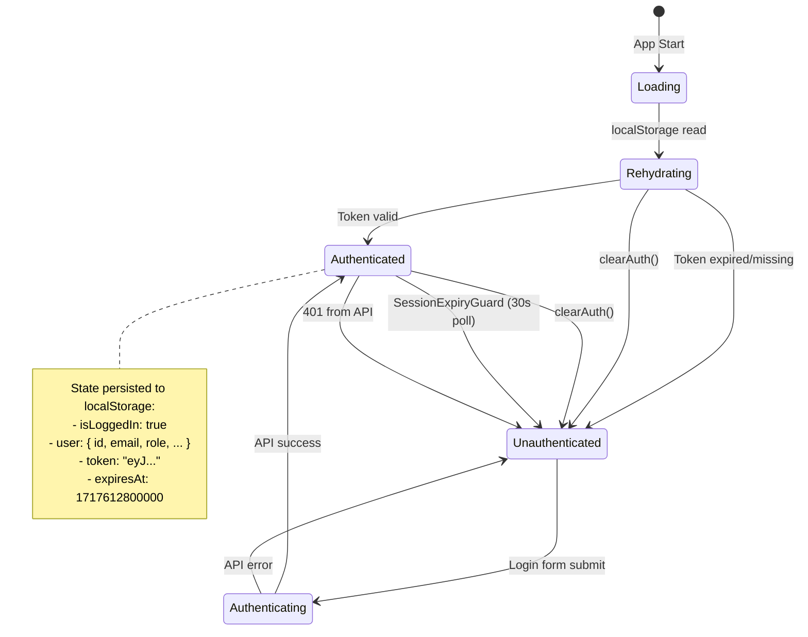
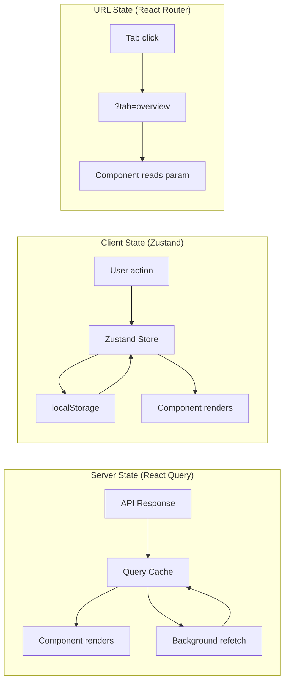
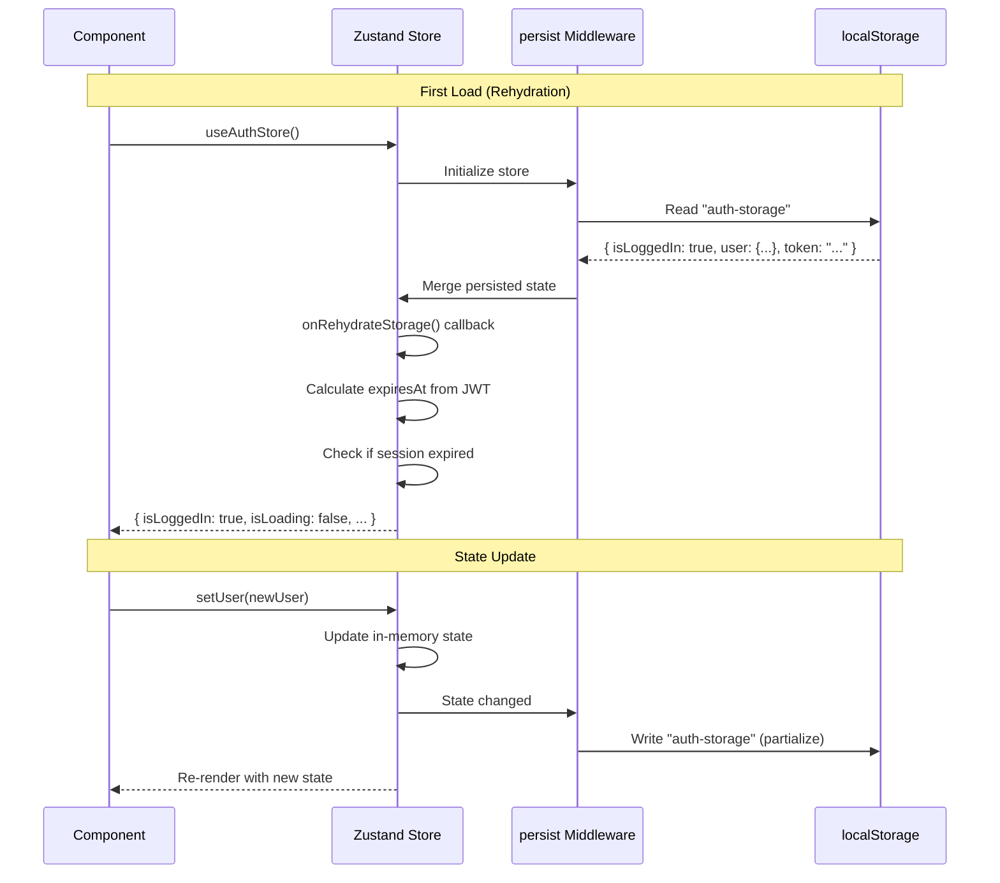

# 03 — State Management

> **Client State:** Zustand (persisted to localStorage)  
> **Server State:** React Query (in-memory cache)  
> **URL State:** React Router (`?tab=` query params)  
> **Last Synced:** 2026-06-05

---

## 1. State Management Architecture

The project follows a **clear separation of concerns** for state:

```
┌─────────────────────────────────────────────────────────────────┐
│                     STATE MANAGEMENT LAYERS                      │
│                                                                  │
│  ┌───────────────────────────────────────────────────────────┐  │
│  │  Server State (React Query)                               │  │
│  │  • API responses, mutations                               │  │
│  │  • Auto-cached, deduplicated, background-refetched        │  │
│  │  • staleTime: 5min, gcTime: 10min                         │  │
│  └───────────────────────────────────────────────────────────┘  │
│                                                                  │
│  ┌───────────────────────────────────────────────────────────┐  │
│  │  Persistent Client State (Zustand + localStorage)         │  │
│  │  • Auth token + user info                                  │  │
│  │  • Theme preference (light/dark/system)                    │  │
│  │  • Notification unread count                               │  │
│  │  • User settings (font size, language, sidebar behavior)   │  │
│  └───────────────────────────────────────────────────────────┘  │
│                                                                  │
│  ┌───────────────────────────────────────────────────────────┐  │
│  │  URL State (React Router)                                 │  │
│  │  • Active tab (?tab=overview, ?tab=sessions, etc.)         │  │
│  │  • Search params, query filters                            │  │
│  │  • Route params (:id, :sessionId, etc.)                    │  │
│  └───────────────────────────────────────────────────────────┘  │
│                                                                  │
│  ┌───────────────────────────────────────────────────────────┐  │
│  │  Form State (react-hook-form + Zod)                       │  │
│  │  • Form inputs, validation state                           │  │
│  │  • Submit status, error state                              │  │
│  └───────────────────────────────────────────────────────────┘  │
│                                                                  │
│  ┌───────────────────────────────────────────────────────────┐  │
│  │  Component State (useState / useRef)                      │  │
│  │  • Modals, dropdowns, local UI toggles                     │  │
│  │  • Temporary input values                                  │  │
│  └───────────────────────────────────────────────────────────┘  │
└─────────────────────────────────────────────────────────────────┘
```

---

## 2. Zustand Stores

All stores use the **`persist` middleware** with `localStorage` for cross-session persistence.

### 2.1 — Auth Store (`stores/authStore.ts`)

**Storage key:** `auth-storage`

```typescript
export interface AuthState {
  // State
  isLoggedIn: boolean;
  isLoading: boolean; // true until localStorage rehydration completes
  user: User | null;
  token: string | null;
  expiresAt: number | null; // Epoch ms of JWT expiry

  // Actions
  setUser: (user: User | null) => void;
  setToken: (token: string | null) => void;
  setExpiresAt: (expiresAt: number | null) => void;
  setIsLoggedIn: (isLoggedIn: boolean) => void;
  setIsLoading: (isLoading: boolean) => void;
  clearAuth: () => void;
}
```

**Persisted fields** (via `partialize`):

```typescript
partialize: (state) => ({
  isLoggedIn: state.isLoggedIn,
  user: state.user,
  token: state.token,
  expiresAt: state.expiresAt,
});
```

**Rehydration logic** (`onRehydrateStorage`):

```typescript
onRehydrateStorage: () => (state) => {
  if (state) {
    // Recalculate expiresAt from JWT if missing
    const restoredExpiresAt = state.expiresAt ?? getTokenExpiresAt(state.token);
    if (state.expiresAt !== restoredExpiresAt) {
      state.setExpiresAt(restoredExpiresAt);
    }
    // Auto-logout if session expired while stored
    if (state.isLoggedIn && isSessionExpired(restoredExpiresAt)) {
      state.clearAuth();
    }
    state.setIsLoading(false); // Signal rehydration complete
  }
};
```

**`clearAuth` action:**

```typescript
clearAuth: () => {
  // 1. Remove current user ID from localStorage
  localStorage.removeItem("current-user-id");

  // 2. Disconnect WebSocket (dynamic import to avoid circular dep)
  import("@/services/socket.manager")
    .then(({ socketService }) => socketService.disconnect())
    .catch(console.error);

  // 3. Reset state
  set({ isLoggedIn: false, user: null, token: null, expiresAt: null });
};
```

**Helper function:**

```typescript
export function getDashboardPath(role?: string): string {
  switch (role?.toUpperCase()) {
    case "ADMIN":
      return "/admin";
    case "MENTOR":
      return "/mentor";
    case "STAFF":
      return "/staff";
    default:
      return "/user";
  }
}
```

### 2.2 — Theme Store (`stores/themeStore.ts`)

**Storage key:** `theme-storage`

```typescript
type Theme = "light" | "dark" | "system";

interface ThemeState {
  theme: Theme;
  setTheme: (theme: Theme) => void;
}
```

**Theme application:**

```typescript
export function applyTheme(theme: Theme): void {
  const effectiveTheme = getEffectiveTheme(theme);
  const root = document.documentElement;

  if (effectiveTheme === "dark") {
    root.classList.add("dark");
  } else {
    root.classList.remove("dark");
  }
}
```

**System preference listener:**

```typescript
// Auto-listens for OS theme changes when "system" is selected
const mediaQuery = window.matchMedia("(prefers-color-scheme: dark)");
mediaQuery.addEventListener("change", () => {
  const { theme } = useThemeStore.getState();
  if (theme === "system") {
    applyTheme(theme);
  }
});
```

### 2.3 — Settings Store (`stores/settingsStore.ts`)

**Storage key:** `settings-storage`

```typescript
type FontSize = "small" | "default" | "large";
type SidebarBehavior = "always-open" | "auto-collapse";
type Language = "vi" | "en";

interface SettingsState {
  _version: number; // Schema version for migrations
  fontSize: FontSize; // Applied via data-font-size attribute
  language: Language; // UI language
  sidebarBehavior: SidebarBehavior; // Desktop sidebar behavior
  muteSoundNotification: boolean; // Mute notification sounds
  muteToastNotification: boolean; // Mute sonner toast pop-ups

  // Actions
  setFontSize: (v: FontSize) => void;
  setSidebarBehavior: (v: SidebarBehavior) => void;
  setMuteSoundNotification: (v: boolean) => void;
  setMuteToastNotification: (v: boolean) => void;
  setLanguage: (v: Language) => void;
  resetToDefaults: () => void;
}
```

**Schema versioning** for graceful migrations:

```typescript
const SETTINGS_SCHEMA_VERSION = 3;

onRehydrateStorage: () => (state) => {
  if (!state) return;
  // Reset to defaults if schema version doesn't match (exact equality, not less-than)
  // This means ANY version mismatch triggers a full reset — both upgrades AND downgrades
  if (state._version !== SETTINGS_SCHEMA_VERSION) {
    state.resetToDefaults();
    return; // Early return — resetToDefaults already applies font size
  }
  // Re-apply font size on page load (CSS attribute may have been cleared)
  applyFontSize(state.fontSize);
};
```

**Why `!==` instead of `<`?** The check uses strict inequality because:

1. **Downgrade protection**: If a user runs an older version of the app after a newer one, the settings should reset too
2. **Simplicity**: No need for incremental migration logic — just reset to defaults
3. **Safety**: Settings are FE-only preferences (font size, language, sidebar behavior) — losing them on version change is acceptable

**Font size application:**

```typescript
export function applyFontSize(fontSize: FontSize): void {
  const root = document.documentElement;
  root.setAttribute("data-font-size", fontSize);
}
```

CSS handles the actual sizing:

```css
html[data-font-size="small"] {
  font-size: 14px;
}
html[data-font-size="default"] {
  font-size: 16px;
}
html[data-font-size="large"] {
  font-size: 18px;
}
```

### 2.4 — Notification Store (`stores/notificationStore.ts`)

**Storage key:** `notification-storage`

```typescript
interface NotificationState {
  unreadCount: number;
  notifications: Notification[];
  isDropdownOpen: boolean;

  // Actions
  setUnreadCount: (count: number) => void;
  incrementUnread: () => void;
  decrementUnread: () => void;
  markAsRead: (id: number) => void;
  markAllAsRead: () => void;
  toggleDropdown: () => void;
  closeDropdown: () => void;
  addNotification: (notification: Notification) => void;
  setNotifications: (notifications: Notification[]) => void;
}
```

**Partialized persistence** — only `unreadCount` is persisted:

```typescript
partialize: (state) => ({ unreadCount: state.unreadCount });
```

Notifications themselves are fetched fresh from the API on each session load. Only the unread count is preserved to show the badge immediately before the API call completes.

---

## 3. Store Summary Table

| Store               | Storage Key            | Persisted Fields                           | Purpose                |
| ------------------- | ---------------------- | ------------------------------------------ | ---------------------- |
| `authStore`         | `auth-storage`         | `isLoggedIn`, `user`, `token`, `expiresAt` | JWT auth state         |
| `themeStore`        | `theme-storage`        | `theme`                                    | Dark/light/system mode |
| `settingsStore`     | `settings-storage`     | All fields (versioned)                     | FE preferences         |
| `notificationStore` | `notification-storage` | `unreadCount` only                         | Notification state     |

---

## 4. Context Providers

The project deliberately uses **minimal React Context** — only one exists:

### 4.1 — QueryProvider

```typescript
// src/contexts/QueryProvider.tsx
export function QueryProvider({ children }: QueryProviderProps) {
  return (
    <QueryClientProvider client={queryClient}>
      {children}
    </QueryClientProvider>
  );
}
```

This is the **only React Context** in the project. All other global state goes through Zustand stores. The rationale is:

1. **Zustand avoids re-render cascades** — components subscribe to only the slices they use (via selector functions), whereas React Context re-renders all consumers when the provider value changes
2. **Persistence is built-in** — Zustand's `persist` middleware handles localStorage serialization, schema versioning, and rehydration lifecycle
3. **No Provider nesting** — Zustand stores are imported directly as hooks (`useAuthStore()`, `useThemeStore()`), eliminating the "Provider hell" anti-pattern
4. **DevTools compatible** — Zustand stores are individually inspectable in React DevTools without needing a custom context wrapper

### 4.1.1 — QueryClient Configuration Deep Dive

The `QueryClient` is created as a **module-level singleton** (`src/lib/queryClient.ts`) and shared across the entire application:

```typescript
export const queryClient = new QueryClient({
  defaultOptions: {
    queries: {
      retry: 3, // Retry up to 3 times
      retryDelay: (attemptIndex) => Math.min(1000 * 2 ** attemptIndex, 30000),
      // Exponential backoff: 1s → 2s → 4s, capped at 30s
      staleTime: 5 * 60 * 1000, // Data fresh for 5 minutes
      gcTime: 10 * 60 * 1000, // Cache garbage collected after 10 minutes
      refetchOnWindowFocus: false, // No refetch on tab focus (per-query override available)
    },
    mutations: {
      retry: 1, // Mutations retry only once (side effects risk)
    },
  },
});
```

**Why these specific values?**

| Config                        | Value                  | Rationale                                                                                                                   |
| ----------------------------- | ---------------------- | --------------------------------------------------------------------------------------------------------------------------- |
| `retry: 3`                    | For queries            | Network flukes are common; 3 retries with backoff covers most transient failures                                            |
| `retryDelay`                  | Exponential 1s→30s cap | Prevents hammering the backend during outages                                                                               |
| `staleTime: 5min`             | For queries            | Most data (sessions, users, reviews) doesn't change within 5 minutes; reduces unnecessary API calls                         |
| `gcTime: 10min`               | For queries            | Keeps recently-viewed data in memory for quick back-navigation; 10min is reasonable for a dashboard app                     |
| `refetchOnWindowFocus: false` | For queries            | The app already has `SessionExpiryGuard` polling + WebSocket for real-time updates; window focus refetch would be redundant |
| `retry: 1`                    | For mutations          | Mutations have side effects (payment, create, delete); retrying a failed mutation could cause duplicate operations          |

**Per-query overrides** are used when needed:

```typescript
// Override staleTime for real-time data
$api.useQuery("get", "/api/notifications", {
  queryOptions: {
    staleTime: 30_000, // 30 seconds — notifications change frequently
    refetchInterval: 30_000, // Poll every 30s
  },
});
```

### 4.2 — Session Payment Context (localStorage-based)

```typescript
// src/lib/session-payment-context.ts
// NOTE: Despite the name, this is NOT a React Context.
// It's a localStorage-based state manager for payment recovery.

export interface SessionPaymentContext {
  sessionId: number;
  userId?: number;
  paymentPurpose: "MENTOR_INTERVIEW";
  checkoutUrl?: string;
  checkoutToken?: string;
  orderCode?: string;
  transactionCode?: string;
  createdAt: string;
}
```

**Storage key:** `inblue.session-payment.pending`
**TTL:** 2 hours (`PAYMENT_CONTEXT_MAX_AGE_MS = 1000 * 60 * 60 * 2`)

This stores pending payment context in `localStorage` to enable **payment flow recovery** if the user navigates away or the browser refreshes during payment processing. The flow is:

1. User clicks "Pay" → `savePendingSessionPaymentContext()` stores `sessionId`, `checkoutUrl`, `orderCode`
2. User is redirected to payment gateway (VNPay/Momo)
3. On callback (`/payment/success` or `/payment/callback`), `getPendingSessionPaymentContext()` retrieves the context
4. Context is used to display session-specific success info and trigger status sync
5. After successful sync or after 2 hours, context is cleared via `clearPendingSessionPaymentContext()`

**Related: Session Paid Status Sync** (`src/lib/session-paid-status-sync.ts`)

For payment methods that don't have reliable webhooks (Momo), a **client-side sync mechanism** polls the backend to confirm payment:

```typescript
// Storage key: "inblue.session-paid-status-sync.v1"
// Max age: 4 hours

export interface PendingSessionPaidStatusSync {
  sessionId: number;
  userId: number;
  transactionCode?: string;
  createdAt: string;
  updatedAt: string;
  retryCount: number;
}
```

The sync is **page-level** (not `App.tsx`). When the user navigates to any of 4 session-related pages (`InterviewHistoryPage`, `SessionHistoryPage`, `SessionDetailPage`, `SessionRoomPage`), each page checks for pending syncs and attempts reconciliation via `sessionManager.markSessionAsPaidWithRetry()`. Retry is gated by `canRetryPendingSessionPaidStatusSync()` (max 8 retries, min 4s interval, 4h max age). See **§10 of `06_Utilities.md`** for the full flow diagram.

---

## 5. State Flow Diagrams

### 5.1 — Authentication State Flow



### 5.2 — Server State vs. Client State



### 5.3 — Zustand Persist Middleware Flow



---

## 6. Patterns & Guidelines

### 6.1 — When to Use Zustand vs. React Query

| Scenario                     | Use             | Reason                                          |
| ---------------------------- | --------------- | ----------------------------------------------- |
| Data fetched from API        | React Query     | Auto-caching, deduplication, background refresh |
| Auth token / user info       | Zustand         | Needs persistence, not refetched from API       |
| UI preferences (theme, font) | Zustand         | FE-only, no API counterpart                     |
| Notification unread count    | Zustand         | Needs instant UI update + persistence           |
| Form inputs                  | react-hook-form | Form-specific state management                  |
| URL-dependent state          | React Router    | Tab selection, search params, filters           |
| Modal/dropdown open state    | `useState`      | Transient, component-local                      |

### 6.2 — Zustand Store Creation Pattern

```typescript
import { create } from "zustand";
import { createJSONStorage, persist } from "zustand/middleware";

export const useMyStore = create<MyState>()(
  persist(
    (set) => ({
      // State
      myField: defaultValue,

      // Actions (always use `set` with callback for atomic updates)
      setMyField: (value) => set({ myField: value }),
    }),
    {
      name: "my-storage", // localStorage key
      storage: createJSONStorage(() => localStorage), // Serialization
      partialize: (state) => ({
        // Only persist these
        myField: state.myField,
      }),
    }
  )
);
```

### 6.3 — Consuming Stores in Components

```typescript
// ✅ Subscribe to specific slice (re-renders only when that slice changes)
const user = useAuthStore((state) => state.user);
const setTheme = useThemeStore((state) => state.setTheme);

// ✅ Get multiple slices
const { isLoggedIn, user } = useAuthStore();

// ❌ Don't destructure the entire store (causes re-renders on any change)
const store = useAuthStore();
```

---

_Document generated from source code analysis on 2026-06-05._
