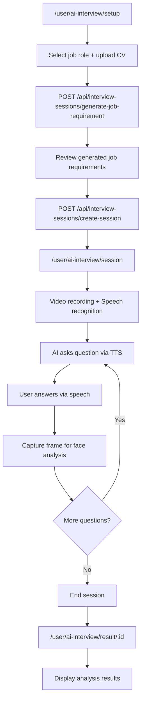
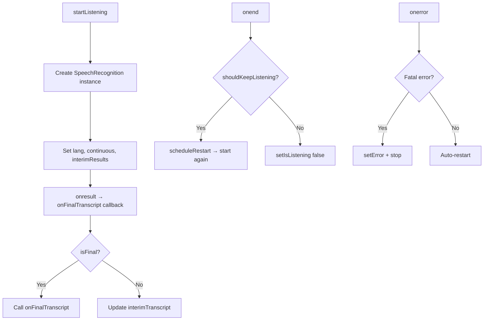
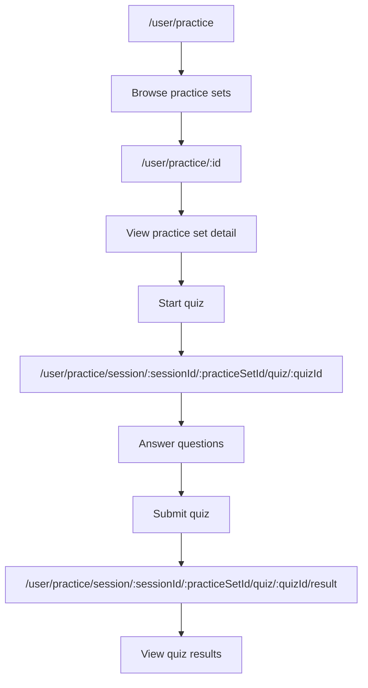
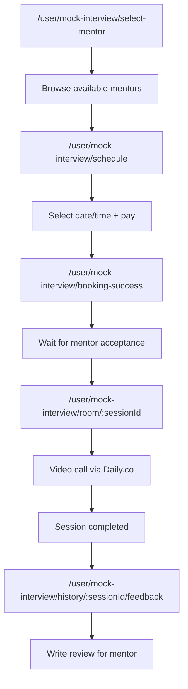

# AI Interview & Practice Features

> **Source:** `src/pages/User/AIInterview/`, `src/pages/User/Practice/`, `src/hooks/useInterviewSession.ts`, `src/hooks/useInterviewAnalysis.ts`, `src/hooks/useSpeechRecognition.ts`, `src/hooks/useSpeechSynthesis.ts`  
> **Last Synced:** 2026-06-05

---

## 1. Overview

The AI Interview system provides automated mock interviews powered by:

- **Speech Recognition** (Web Speech API) for user's spoken answers
- **Speech Synthesis** (Web Speech API) for AI questions
- **Face Behavior Analysis** (Backend API) for facial expression analysis
- **Job Description Generation** (Backend API) from user inputs

---

## 2. AI Interview Flow



---

## 3. API Hooks (using `$api`)

### Interview Session Hooks (`useInterviewSession.ts`)

```typescript
// Config options (job roles, CV upload settings)
useInterviewConfigOptions(); // GET /api/interview-sessions/config-options

// Generate job requirements from CV
useGenerateJobRequirement(); // POST /api/interview-sessions/generate-job-requirement

// Create interview session
useCreateInterviewSession(); // POST /api/interview-sessions/create-session

// Get session by ID
useInterviewSession(sessionId); // GET /api/interview-sessions/{sessionId}

// Get sessions by user
useInterviewSessionsByUser(userId); // GET /api/interview-sessions/user/{userId}

// Get cached session data
useInterviewSessionCache(sessionKey); // GET /api/interview-sessions/cache/{sessionKey}
```

### Face Analysis Hook (`useInterviewAnalysis.ts`)

```typescript
useAnalyzeFaceBehavior(); // POST image → backend face analysis
```

---

## 4. Speech Recognition (`useSpeechRecognition.ts`)

### Features

- **Continuous mode**: Auto-restarts recognition after `onend` events
- **Interim results**: Shows real-time partial transcript
- **Language support**: Default `vi-VN`, configurable
- **Reminder system**: Periodic reminders (default 5min) if user is silent
- **Error recovery**: Auto-restarts on non-fatal errors

### Interface

```typescript
interface UseSpeechRecognitionReturn {
  isListening: boolean;
  interimTranscript: string;
  isSupported: boolean;
  error: string | null;
  startListening: () => void;
  stopListening: () => void;
}
```

### Lifecycle



### Error Handling Table

The hook maps each Web Speech API error to a user-friendly i18n message:

| Error Code      | Meaning                          | Action Taken             | i18n Key                                                        |
| --------------- | -------------------------------- | ------------------------ | --------------------------------------------------------------- |
| `no-speech`     | No speech detected               | Auto-restart after 350ms | _(no error shown)_                                              |
| `aborted`       | Recognition aborted by browser   | Silently ignored         | _(no error shown)_                                              |
| `not-allowed`   | Microphone permission denied     | Fatal — stops listening  | `general.theBrowserIsNotGranted`                                |
| `audio-capture` | No microphone found              | Fatal — stops listening  | `general.noMicrophoneFoundPleaseCheck`                          |
| `network`       | Network error during recognition | Fatal — stops listening  | `general.networkErrorWhenRecognizingVoice`                      |
| _(unknown)_     | Any other error                  | Fatal — stops listening  | `general.speechRecognitionError` (with error name interpolated) |

### Restart Logic

The hook uses a **two-ref pattern** to manage restart behavior:

- `shouldKeepListeningRef` — `true` while the user wants continuous recognition
- `stopRequestedRef` — `true` when a fatal error or explicit stop occurs

On `onend`, the hook checks both refs:

```typescript
recognition.onend = () => {
  if (shouldKeepListeningRef.current && !stopRequestedRef.current) {
    scheduleRestart(250); // 250ms delay prevents rapid restart loops
    return;
  }
  setIsListening(false);
  setInterimTranscript("");
};
```

The `scheduleRestart` function uses `setTimeout` (not `setInterval`) to avoid overlapping restart attempts. The 250ms delay prevents rapid restart loops that some browsers trigger. A `try/catch` around `recognition.start()` silently catches `InvalidStateError` if the browser is still in a listening state.

### Silent Reminder System

When the user is silent for too long during an interview, a reminder fires:

```typescript
// Default: 5 minutes of silence
const reminderIntervalMs = options?.reminderIntervalMs ?? 5 * 60 * 1000;

// Recursive scheduling — fires every reminderIntervalMs while listening
const scheduleNext = () => {
  reminderTimeoutRef.current = window.setTimeout(() => {
    if (!shouldKeepListeningRef.current || stopRequestedRef.current) return;
    const startedAt = listeningStartedAtRef.current;
    if (startedAt !== null) {
      onReminderRef.current?.(Date.now() - startedAt); // Elapsed time in ms
    }
    scheduleNext(); // Schedule next reminder
  }, reminderIntervalMs);
};
```

The `onReminder` callback receives the total elapsed time since recognition started, allowing the UI to display messages like "Bạn đã im lặng 5 phút, hãy tiếp tục trả lời."

### Callback Ref Pattern

The hook keeps callbacks (`onFinalTranscript`, `onReminder`) up-to-date via refs + useEffect, avoiding stale closures in native event handlers:

```typescript
const onFinalTranscriptRef = useRef(onFinalTranscript);
useEffect(() => {
  onFinalTranscriptRef.current = onFinalTranscript;
}, [onFinalTranscript]);

// Inside recognition.onresult (native event handler):
onFinalTranscriptRef.current?.(finalText.trim());
```

This is necessary because `SpeechRecognition.onresult` is set once during initialization but must call the latest callback version — refs are the only safe way to bridge native event handlers with React's mutable callback references.

### Cleanup Lifecycle

On unmount (or `lang` change), the cleanup function ensures all async timers and state are properly torn down:

```typescript
return () => {
  stopRequestedRef.current = true;
  shouldKeepListeningRef.current = false;
  clearRestartTimeout();
  clearReminderTimeout();
  recognition.abort(); // Stops recognition + fires onend
  recognitionRef.current = null;
};
```

The order matters: setting `stopRequestedRef.current = true` before `recognition.abort()` prevents the `onend` handler from scheduling a restart. `recognition.abort()` (not `.stop()`) immediately terminates recognition without waiting for final results.

---

## 5. Speech Synthesis (`useSpeechSynthesis.ts`)

### Features

- Text-to-speech for AI questions
- Voice selection (prefers Vietnamese voice)
- Rate/pitch control
- Interrupt and queue management
- ResponsiveVoice fallback chain (when available)

### Voice Selection Strategy

The hook implements a priority-based voice selection:

1. **Vietnamese voice** — searches for voices with `lang` starting with `"vi"` (e.g., `vi-VN`)
2. **English fallback** — falls back to any available English voice
3. **Default browser voice** — last resort if no preferred voices found

Voices are loaded asynchronously via the `waitForVoices` helper, which uses **polling + event listener + timeout** to handle browsers that load voices lazily:

```typescript
const waitForVoices = async (
  synth: SpeechSynthesis,
  maxWaitMs = 1800
): Promise<SpeechSynthesisVoice[]> => {
  const existing = synth.getVoices();
  if (existing.length > 0) return existing;

  return await new Promise<SpeechSynthesisVoice[]>((resolve) => {
    const tryResolve = () => {
      if (synth.getVoices().length > 0) {
        cleanup();
        resolve(synth.getVoices());
      }
    };
    const cleanup = () => {
      synth.removeEventListener("voiceschanged", tryResolve);
      clearInterval(pollIntervalId);
      clearTimeout(timeoutId);
    };
    const pollIntervalId = window.setInterval(tryResolve, 250);
    const timeoutId = window.setTimeout(() => {
      cleanup();
      resolve(synth.getVoices());
    }, maxWaitMs);
    synth.addEventListener("voiceschanged", tryResolve);
    tryResolve();
  });
};
```

The hook also polls `speechSynthesis.getVoices()` every 400ms for 6 seconds via `useEffect` to handle late-loading voices in Firefox and other browsers.

### Stale-Request Prevention (`speakRequestIdRef`)

Like `DeviceCheckDialog` (§6 of Video_Call_Feature), the synthesis hook uses an incrementing request ID to prevent stale `onend` callbacks from affecting state when `cancel()` is called before a new `speak()`:

```typescript
const speakRequestIdRef = useRef(0);

const speak = useCallback((text: string, id: string | number) => {
  speechSynthesis.cancel();
  speakRequestIdRef.current += 1;
  const requestId = speakRequestIdRef.current;
  // ... create utterance ...
  utterance.onend = () => {
    if (requestId !== speakRequestIdRef.current) return; // Stale — ignore
    setIsSpeaking(false);
    setSpeakingId(null);
  };
}, []);
```

### Mute State Persistence

The `isMuted` state is initialized from `localStorage` key `"tts-muted"` and updated via `toggleMute()`. This persists the mute preference across page navigations within the same browser session — critical for interview flows where the user navigates between rooms.

### Unmount Cleanup

```typescript
useEffect(() => {
  return () => {
    speakRequestIdRef.current += 1; // Invalidate any pending onend
    window.speechSynthesis.cancel(); // Stop any playing utterance
    stopResponsiveVoicePlayback(); // Stop ResponsiveVoice if active
  };
}, [isSupported, isWebSpeechSupported]);
```

The `speakRequestIdRef` increment before `cancel()` prevents the `onend` handler from resetting `isSpeaking` to `false` after unmount (which would trigger a React state update on an unmounted component).

### Interrupt Management

```typescript
const speak = useCallback(
  (text: string) => {
    // Cancel any in-progress speech
    speechSynthesis.cancel();

    const utterance = new SpeechSynthesisUtterance(text);
    utterance.voice = selectedVoice;
    utterance.rate = rate; // Default: 1.0
    utterance.pitch = pitch; // Default: 1.0
    utterance.lang = "vi-VN";

    utterance.onend = () => {
      setIsSpeaking(false);
      onEnd?.();
    };

    setIsSpeaking(true);
    speechSynthesis.speak(utterance);
  },
  [selectedVoice, rate, pitch, onEnd]
);
```

Key behavior: `speechSynthesis.cancel()` before each new utterance ensures only one voice plays at a time. Without this, browsers would queue utterances and play them sequentially.

### ResponsiveVoice Fallback

The project has a ResponsiveVoice integration layer (`speech-synthesis.utils.ts`) that wraps the global `responsiveVoice` object. The priority chain is:

1. **ResponsiveVoice** (if loaded and available) — better cross-browser voice quality
2. **Native Web Speech API** (fallback) — `speechSynthesis.speak()`

**Testing caveat**: `speechSynthesis.speak()` assertions in jsdom are **flaky** because jsdom doesn't actually synthesize audio. Prefer asserting on state (`isSpeaking`, `selectedVoice`) rather than verifying `speak()` was called. For thorough TTS validation, use real browser E2E tests.

---

## 5.1 Face Behavior Analysis

The interview captures video frames at intervals and sends them to the backend for facial expression analysis:

```typescript
// Captures current video frame as base64 image
const captureFrame = (): string | null => {
  const video = videoRef.current;
  if (!video || !canvasRef.current) return null;

  const ctx = canvasRef.current.getContext("2d");
  if (!ctx) return null;

  canvasRef.current.width = video.videoWidth;
  canvasRef.current.height = video.videoHeight;
  ctx.drawImage(video, 0, 0);

  return canvasRef.current.toDataURL("image/jpeg", 0.8);
};
```

The `useAnalyzeFaceBehavior` hook sends the captured frame to `POST /api/face-analysis/analyze`, which returns emotion scores (confident, nervous, smiling, etc.). Results are displayed in the interview analysis page.

---

## 6. Practice Quiz System

### Quiz Flow



### Data Source

Practice sets and quiz questions come from the backend, managed via Admin dashboard:

- `PracticeSetManagement` → CRUD for practice sets
- `PracticeQuestionManagement` → CRUD for individual questions
- `QuizSetManagement` → CRUD for quiz sets

---

## 7. Mock Interview (Mentor-based)

### Booking Flow



### Payment Integration

- Mentor interview requires payment before booking
- `SessionPaymentContext` tracks pending payment
- Payment flow: create checkout → redirect to VNPay/Momo → callback → activate booking

---

## 8. Interview History

### User View

- Tab `interviewHistory` → `SessionHistoryPage`
- Lists all past mock interview sessions
- Click session → `SessionDetailPage`
- Includes: mentor info, date, status, review

### Mentor View

- Tab `sessions` → `MentorSessionsPage`
- Lists sessions where mentor was assigned
- Click session → `MentorSessionDetailPage`
- Can join room → `MentorSessionRoomPage`
- After completion → write feedback → `WriteFeedbackPage`

### Admin View

- Tab `sessions` → `SessionManagementPage`
- Lists ALL sessions across all users/mentors
- Full CRUD and status management

---

_Document generated from source code analysis on 2026-06-05._
