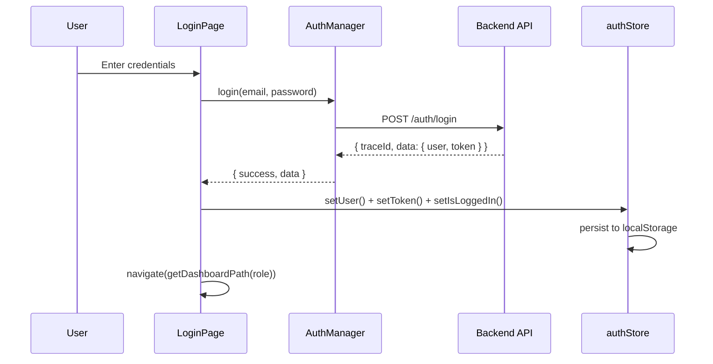
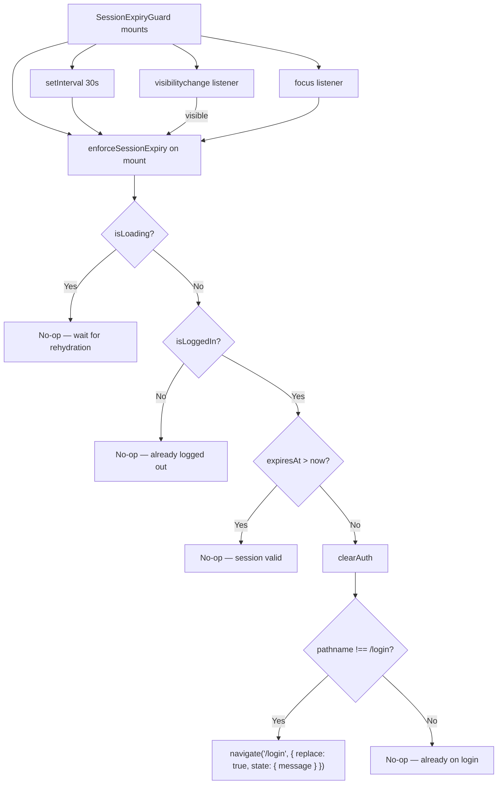
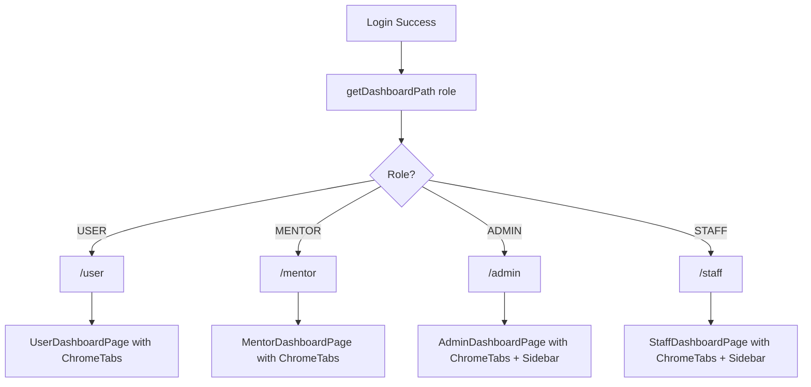
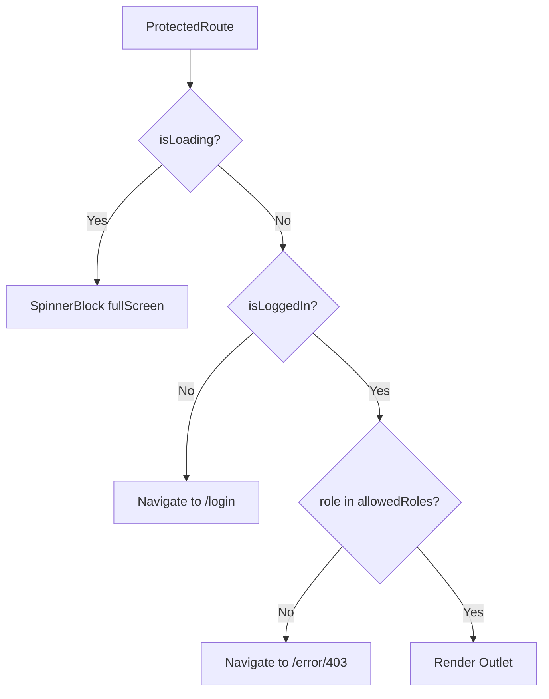
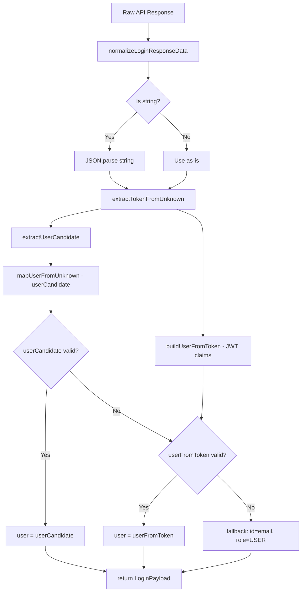

# Authentication Feature

> **Source:** `src/pages/Auth/`, `src/services/auth.manager.ts`, `src/lib/auth-session.ts`, `src/stores/authStore.ts`  
> **Last Synced:** 2026-06-05

---

## 1. Overview

The authentication system supports four roles: `USER`, `MENTOR`, `ADMIN`, `STAFF`. It uses JWT tokens stored in Zustand (persisted to `localStorage` under key `auth-storage`) and Google OAuth2.

### Auth Flow Diagram



---

## 2. LoginPage (`src/pages/Auth/LoginPage.tsx`)

### Key Behaviors

1. **Email/Password form**: Posts to `authManager.login()` → `POST /auth/login`
2. **Google OAuth**: Redirects to `authManager.getGoogleLoginUrl()` → `GET /auth/google`
3. **OAuth callback**: Detects `?token=` or `#token=` in URL → `authManager.consumeGoogleCallbackFromUrl()`
4. **Demo login** (DEV/staging only): `DemoLoginButton` shows pre-filled accounts

### applyAuthState Pattern

Both LoginPage and SignupPage share the same auth state application logic:

```typescript
const applyAuthState = useCallback(
  (payload: LoginAuthPayload) => {
    const parsedUserId = Number(payload.user.id);
    const userId = Number.isFinite(parsedUserId) ? parsedUserId : undefined;

    setUser({
      id: userId,
      name: payload.user.fullName,
      email: payload.user.email,
      role: payload.user.role?.toUpperCase() as "USER" | "ADMIN" | "MENTOR" | "STAFF",
      avatarUrl: payload.user.avatar || undefined,
    });
    setToken(payload.token ?? null);
    setIsLoggedIn(true);

    if (userId && !isNaN(userId)) {
      localStorage.setItem("current-user-id", String(userId));
    }

    navigate(getDashboardPath(payload.user.role), { replace: true });
  },
  [navigate, setIsLoggedIn, setToken, setUser]
);
```

### Route After Login

`getDashboardPath(role)` maps roles to dashboard roots:

- `USER` → `/user`
- `MENTOR` → `/mentor`
- `ADMIN` → `/admin`
- `STAFF` → `/staff`

---

## 3. SignupPage (`src/pages/Auth/SignupPage.tsx`)

### Additional Fields Beyond Login

| Field                          | Purpose                                    |
| ------------------------------ | ------------------------------------------ |
| `fullName`                     | Display name                               |
| `university`                   | Free-text input                            |
| `major`                        | Select dropdown from `constants/majors.ts` |
| `password` + `confirmPassword` | With visibility toggle                     |
| `agreeTerms`                   | Checkbox                                   |

Uses `authManager.signup()` → `POST /auth/signup`.

---

## 4. AuthManager Service (`src/services/auth.manager.ts`)

### Key Methods

| Method                           | HTTP | Endpoint       | Description                        |
| -------------------------------- | ---- | -------------- | ---------------------------------- |
| `login()`                        | POST | `/auth/login`  | Email/password login               |
| `signup()`                       | POST | `/auth/signup` | User registration                  |
| `googleLogin()`                  | GET  | `/auth/google` | Redirect to Google OAuth           |
| `getGoogleCallbackError()`       | -    | URL parsing    | Extract OAuth errors from URL      |
| `consumeGoogleCallbackFromUrl()` | -    | URL parsing    | Extract JWT + user from URL hash   |
| `hasGoogleCallbackPayload()`     | -    | URL parsing    | Check if URL contains OAuth tokens |
| `getGoogleLoginUrl()`            | -    | Config         | Build Google OAuth redirect URL    |

### OAuth Token Extraction

The manager parses multiple URL parameter patterns:

- `?token=`, `?accessToken=`, `?access_token=`
- `#token=`, `#accessToken=`, `#access_token=`
- Backend may deliver via query params or URL fragment (hash)

### Response Shape

```typescript
type LoginPayload = {
  user: {
    id: string;
    email: string;
    fullName: string;
    role: "ADMIN" | "USER" | "MENTOR" | "STAFF";
    avatar?: string | null;
    bio?: string;
  };
  token?: string;
};
```

---

## 5. Session Expiry Guard



### Navigate State Message

When the session expires, `SessionExpiryGuard` passes a **translated message** to the login page via React Router's `navigate` state:

```typescript
clearAuth();
if (location.pathname !== "/login") {
  navigate("/login", {
    replace: true,
    state: {
      message: t("compShared.loginSessionHasExpiredPlease"),
    },
  });
}
```

The login page can read this message via `useLocation().state?.message` and display it as a toast or inline alert, informing the user **why** they were redirected. This is important UX — without it, users would see the login page with no explanation.

### Triple-Trigger Architecture

The guard runs `enforceSessionExpiry()` on three triggers:

| Trigger           | Mechanism                   | When it fires                                           |
| ----------------- | --------------------------- | ------------------------------------------------------- |
| Mount             | `useEffect` (no deps)       | Component first renders                                 |
| Interval          | `setInterval(30000)`        | Every 30 seconds while logged in                        |
| Visibility change | `document.visibilitychange` | When tab becomes visible (tab switch, minimize restore) |
| Window focus      | `window.focus`              | When browser window gains focus                         |

The interval is **only active when `isLoggedIn`** — it's cleaned up when the user logs out (the `useEffect` dependency on `isLoggedIn` ensures the interval is cleared).

### Guard Implementation Details

- Returns `null` — renders no DOM elements
- Uses `window.setInterval` (not `setInterval`) for clarity about the global scope
- Cleanup functions properly clear the interval and remove event listeners
- The `enforceSessionExpiry` callback is wrapped in `useCallback` with dependencies `[clearAuth, expiresAt, isLoading, isLoggedIn, location.pathname, navigate, t]` — it re-creates only when these values change

---

## 5.1 JWT Decode (`src/lib/auth-session.ts`)

The frontend decodes JWT tokens **without any library** — it uses the browser's native `atob()` with base64url handling. There are two functions: `getTokenExpiresAt()` decodes + extracts expiry, and `isSessionExpired()` checks if a given expiry timestamp has passed.

```typescript
const JWT_SEGMENT_COUNT = 3;

function decodeBase64Url(value: string): string | null {
  try {
    // base64url → base64: replace URL-safe chars, restore padding
    const normalized = value.replace(/-/g, "+").replace(/_/g, "/");
    const padded = normalized.padEnd(Math.ceil(normalized.length / 4) * 4, "=");
    return atob(padded);
  } catch {
    return null;
  }
}

export function getTokenExpiresAt(token: string | null | undefined): number | null {
  if (!token) return null; // No token → return null (no expiry)

  // Strip "Bearer " prefix if present (defensive)
  const normalizedToken = token.replace(/^Bearer\s+/i, "").trim();
  const parts = normalizedToken.split(".");

  if (parts.length < JWT_SEGMENT_COUNT) return Date.now(); // Malformed → immediate expiry

  const payloadJson = decodeBase64Url(parts[1]);
  if (!payloadJson) return Date.now(); // Invalid base64 → immediate expiry

  try {
    const payload = JSON.parse(payloadJson) as { exp?: unknown };
    if (typeof payload.exp === "number" && Number.isFinite(payload.exp)) {
      return payload.exp * 1000; // Convert seconds → milliseconds
    }
    return Date.now(); // No exp field → immediate expiry
  } catch {
    return Date.now(); // Parse error → immediate expiry
  }
}

export function isSessionExpired(
  expiresAt: number | null | undefined,
  now: number = Date.now()
): boolean {
  // Non-numeric or non-finite values → NOT expired (safe fallback)
  if (typeof expiresAt !== "number" || !Number.isFinite(expiresAt)) {
    return false;
  }
  return now >= expiresAt;
}
```

Key behaviors:

- **No library dependency** — avoids `jwt-decode` package for a single decode operation
- **base64url compliance** — handles JWT's URL-safe encoding (RFC 7515 §2), with `padEnd` padding normalization
- **Bearer prefix stripping** — `token.replace(/^Bearer\s+/i, "").trim()` handles tokens that arrive with the prefix
- **Malformed tokens return `Date.now()`** (not `null`) — this means `isSessionExpired(Date.now())` returns `true`, triggering logout
- **`isSessionExpired(null)` returns `false`** — a null expiry means no token existed, so there's nothing to expire

**Edge case**: If the token is malformed, `getTokenExpiresAt` returns `Date.now()`, which `isSessionExpired(Date.now())` treats as expired → forces logout. If the token is `null`/`undefined`, `getTokenExpiresAt` returns `null`, and `isSessionExpired(null)` returns `false` — the app relies on 401 responses to trigger logout naturally.

---

## 5.2 DemoLoginButton (`src/components/DemoLoginButton.tsx`)

The demo login button is **conditionally rendered** (only in `import.meta.env.DEV` or staging):

| Feature                 | Implementation                                               |
| ----------------------- | ------------------------------------------------------------ |
| **Pre-filled accounts** | Hardcoded `DEMO_ACCOUNTS` array with email/password/role     |
| **Visual**              | Expandable card list with role badge, email, password fields |
| **Auto-fill**           | Clicking an account auto-fills the login form fields         |
| **Role indicator**      | Colored badges: blue (USER), red (ADMIN), purple (MENTOR)    |
| **i18n**                | All labels use `t()` for Vietnamese/English                  |

### Demo Accounts

| Role   | Email              | Password | Purpose       |
| ------ | ------------------ | -------- | ------------- |
| USER   | `binhan@gmail.com` | `123`    | Regular user  |
| ADMIN  | `thuson@gmail.com` | `12345`  | Admin panel   |
| MENTOR | `b@fpt.com`        | `12345`  | Mentor portal |

**Security note**: These accounts are only visible in development mode. The `DemoLoginButton` component checks `import.meta.env.DEV` before rendering.

---

## 5.3 Multi-Role Login Race Condition

When a user with multiple roles logs in, there's a potential race condition between:

1. `authStore.setUser()` (writes to localStorage)
2. `navigate(getDashboardPath(role))` (navigates based on role)

The `applyAuthState` pattern handles this by:

1. **Setting all auth state synchronously** (user, token, isLoggedIn) before navigation
2. **Using `useCallback`** to memoize the function and avoid stale closures
3. **Writing `current-user-id`** to localStorage for cross-tab identification

The `ProtectedRoute` component has a **`isLoading` guard** that renders a full-screen spinner while the store rehydrates from localStorage, preventing premature redirects.

### Potential Edge Case

If two browser tabs log in simultaneously with different roles, the last `localStorage` write wins. The `SessionExpiryGuard` component uses the **current tab's store state** (not localStorage directly), so the active tab always reflects the correct user. The inactive tab will redirect to login on its next visibility change.

---

## 6. Post-Login Navigation Flow



---

## 7. Protected Route Logic



---

## 8. Auth Store Interface

The store uses the `User` type from `@/interfaces/schema.types` (NOT a custom `AuthUser`):

```typescript
interface AuthState {
  user: User | null; // From schema.types — extends SchemaUser with optional role + membershipPlan
  token: string | null;
  isLoggedIn: boolean;
  isLoading: boolean; // true until onRehydrateStorage completes
  expiresAt: number | null;

  // Actions
  setUser: (user: User | null) => void;
  setToken: (token: string | null) => void; // Auto-computes expiresAt via getTokenExpiresAt()
  setExpiresAt: (expiresAt: number | null) => void;
  setIsLoggedIn: (isLoggedIn: boolean) => void;
  setIsLoading: (isLoading: boolean) => void;
  clearAuth: () => void;
}
```

### `setToken` — Auto-Computed Expiry

When `setToken` is called, it **automatically** computes `expiresAt` from the JWT:

```typescript
setToken: (token) => set({ token, expiresAt: getTokenExpiresAt(token) }),
```

This means calling `setToken("eyJ...")` will immediately parse the JWT's `exp` claim and store the expiry timestamp — no separate `setExpiresAt` call needed.

### `clearAuth` — Multi-Step Logout

The logout action performs 3 operations:

```typescript
clearAuth: () => {
  // 1. Remove cross-tab user ID marker
  localStorage.removeItem("current-user-id");

  // 2. Disconnect WebSocket (dynamic import to avoid circular dependency)
  import("@/services/socket.manager")
    .then(({ socketService }) => {
      socketService.disconnect();
    })
    .catch(console.error);

  // 3. Reset all auth state
  set({
    isLoggedIn: false,
    user: null,
    token: null,
    expiresAt: null,
  });
},
```

**Key detail**: The socket disconnect uses a **dynamic `import()`** instead of a static import to avoid circular dependency between `authStore` → `socket.manager` → `authStore`. The dynamic import resolves at runtime after the store module has fully loaded.

### Persistence (`partialize`)

```typescript
partialize: (state) => ({
  isLoggedIn: state.isLoggedIn,
  user: state.user,
  token: state.token,
  expiresAt: state.expiresAt,
}),
```

Only `isLoggedIn`, `user`, `token`, and `expiresAt` are persisted. `isLoading` is always initialized as `true` and set to `false` after rehydration — it is **never persisted**.

### Rehydration (`onRehydrateStorage`)

```typescript
onRehydrateStorage: () => (state) => {
  if (state) {
    // Recalculate expiresAt from JWT if missing (migration from old schema)
    const restoredExpiresAt = state.expiresAt ?? getTokenExpiresAt(state.token);
    if (state.expiresAt !== restoredExpiresAt) {
      state.setExpiresAt(restoredExpiresAt);
    }
    // Auto-logout if session expired while browser was closed
    if (state.isLoggedIn && isSessionExpired(restoredExpiresAt)) {
      state.clearAuth();
    }
    state.setIsLoading(false);
  }
},
```

This handles 3 scenarios:

1. **Token expiry recalculation**: If `expiresAt` is missing (old schema), recompute from JWT
2. **Stale session cleanup**: If user closed browser with a valid session that later expired, auto-logout
3. **Loading flag**: Always set to `false` after rehydration completes, unblocking `ProtectedRoute` spinner

---

## 9. Demo Accounts (DEV/Staging Only)

| Role   | Email              | Password |
| ------ | ------------------ | -------- |
| USER   | `binhan@gmail.com` | `123`    |
| ADMIN  | `thuson@gmail.com` | `12345`  |
| MENTOR | `b@fpt.com`        | `12345`  |

---

## 10. AuthManager Deep Dive (`src/services/auth.manager.ts`)

The `AuthManager` class handles login, OAuth callback parsing, and user construction. It is designed to handle **highly variable backend response shapes** — the backend may return tokens and user objects at different nesting levels depending on the auth provider.

### 10.1 Response Parsing (`parseLoginResponse`)

The login API response undergoes multi-layer traversal before a final `LoginPayload` is assembled:



**Key insight**: The user object is resolved with a **priority cascade**:

1. `userCandidate` from the response body (e.g., `data.user` or `data.data.user`)
2. `userFromToken` decoded from the JWT claims
3. Fallback: `id=email, fullName=emailPrefix, role=USER`

### 10.2 Token Extraction (`extractTokenFromUnknown`)

Searches for tokens in 6 possible locations across a deeply nested response:

| Path                     | Example Response Shape                |
| ------------------------ | ------------------------------------- |
| `value` (string)         | `"eyJ..."`                            |
| `value.token`            | `{ token: "eyJ..." }`                 |
| `value.accessToken`      | `{ accessToken: "eyJ..." }`           |
| `value.jwt`              | `{ jwt: "eyJ..." }`                   |
| `value.idToken`          | `{ idToken: "eyJ..." }`               |
| `value.data.token`       | `{ data: { token: "eyJ..." } }`       |
| `value.data.accessToken` | `{ data: { accessToken: "eyJ..." } }` |

Each extracted token goes through `normalizeToken()` which:

1. Strips wrapping quotes (`"..."` → `...`)
2. Strips wrapping single quotes (`'...'` → `...`)
3. Strips `Bearer ` prefix

### 10.3 User Construction from JWT (`buildUserFromToken`)

When a JWT is available but no explicit user object in the response, the manager decodes the JWT payload and extracts:

```typescript
{
  id:     claims.userId ?? claims.id ?? claims.uid ?? claims.sub,  // 4 fallback paths
  email:  claims.email || emailFallback,
  fullName: claims.name ?? claims.fullName ?? claims.preferred_username || emailPrefix,
  role:   mapBackendRoleToFrontend(extractRoleFromClaims(claims)),
  avatar: claims.avatarUrl || claims.avatar,
}
```

### 10.4 Role Extraction (`extractRoleFromClaims`)

Checks 3 JWT claim locations in priority order:

1. `claims.role` — direct string claim
2. `claims.authorities[]` — Spring Security style, takes first string entry
3. `claims.roles[]` — alternative array claim, takes first string entry

Each extracted role then passes through `mapBackendRoleToFrontend()` which strips the `ROLE_` prefix:

```typescript
// "ROLE_ADMIN" → "ADMIN", "ROLE_STAFF" → "STAFF"
// Also handles lowercase: "role_mentor" → "MENTOR"
const normalized = backendRole?.replace(/^ROLE_/i, "").toUpperCase();
```

If the role doesn't match any known value, it defaults to `"USER"`.

### 10.5 OAuth Callback URL Parsing

The `parseOAuthCallbackUrl()` method handles two URL formats:

| Format        | Example                         |
| ------------- | ------------------------------- |
| Query params  | `/login?token=eyJ...&state=abc` |
| Hash fragment | `/login#token=eyJ...&state=abc` |

Both sources are searched via `getFirstParamValue()` which checks keys in priority order:

```
token → accessToken → access_token → jwt → idToken → id_token → error → error_description → code → state
```

**Error detection**: If `error` or `error_description` is found in the URL, the callback is treated as failed with the error message mapped through Vietnamese translations.

### 10.6 Error Mapping (`mapLoginErrorMessage`)

Maps backend error responses to user-friendly Vietnamese messages:

| HTTP Status | Pattern Match                            | Vietnamese Message                     |
| ----------- | ---------------------------------------- | -------------------------------------- |
| 401         | `bad credentials`, `invalid password`    | `general.wrongPassword`                |
| 404         | `user not found`, `not found with email` | `general.wrongEmail`                   |
| 403         | `locked`, `disabled`                     | `general.accountHasBeenLocked`         |
| 429         | —                                        | `general.youHaveEnteredIncorrectlyToo` |
| Other       | —                                        | raw message or `common.error`          |

**Locked account detection**: Before `parseLoginResponse` is called, the response is checked for `userCandidate.isActive === false` — if true, it short-circuits to the locked account error without attempting to parse the user.

### 10.7 `applyAuthState` — Cross-Tab Integration

The `applyAuthState` callback (shared by LoginPage and SignupPage) bridges `AuthManager` → `authStore` → navigation:

1. `setUser()` — stores the user object (note: `applyAuthState` maps `AuthManager`'s `AuthUser.id` (string) to `User.id` (number) via `Number(payload.user.id)`)
2. `setToken()` — triggers auto-computed `expiresAt` in the store
3. `setIsLoggedIn(true)` — sets auth flag
4. `localStorage.setItem("current-user-id", userId)` — **cross-tab marker** used by `socket.service` to identify the connected user across tabs
5. `navigate(getDashboardPath(role), { replace: true })` — redirects to role dashboard using `replace: true` to avoid back-button loops

---

_Document generated from source code analysis on 2026-06-05. Updated 2026-06-06 with AuthManager deep-dive._
