# Payment Feature

> **Source:** `src/pages/Payment/`, `src/lib/payment-recovery.ts`, `src/lib/payment-callback.ts`, `src/lib/session-payment-context.ts`  
> **Last Synced:** 2026-06-06

---

## 1. Overview

The payment system handles subscription payments and mentor interview booking payments through VNPay/Momo integration. It has an extensive **recovery system** to handle callback failures, mismatched identifiers, and edge cases.

### Payment Purposes

| Purpose            | Description                                   |
| ------------------ | --------------------------------------------- |
| `FULLY_PAID`       | Subscription/plan purchase                    |
| `MENTOR_INTERVIEW` | One-time payment for a mock interview session |

---

## 2. Payment Flow Diagram

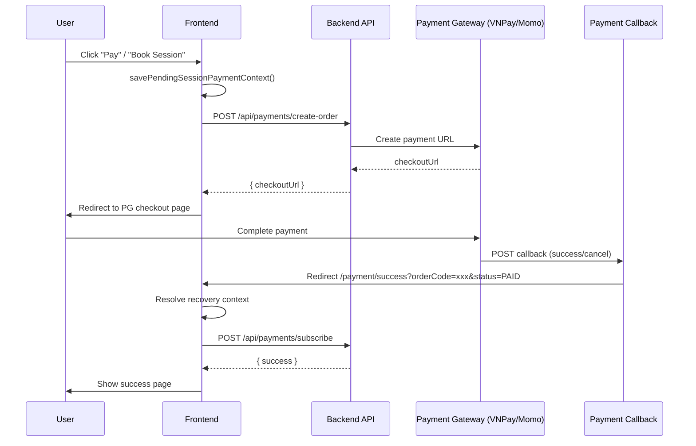

---

## 3. PaymentSuccessPage (`src/pages/Payment/PaymentSuccessPage.tsx`)

### URL Parameters

| Param                                  | Description                           |
| -------------------------------------- | ------------------------------------- |
| `orderCode`                            | Backend order identifier              |
| `transactionCode` / `transaction_code` | Gateway transaction code              |
| `id` / `checkoutId` / `checkout_id`    | Checkout token from payment gateway   |
| `status`                               | Payment status (default: `PAID`)      |
| `source`                               | Callback source (default: `callback`) |

### Resolution State Machine

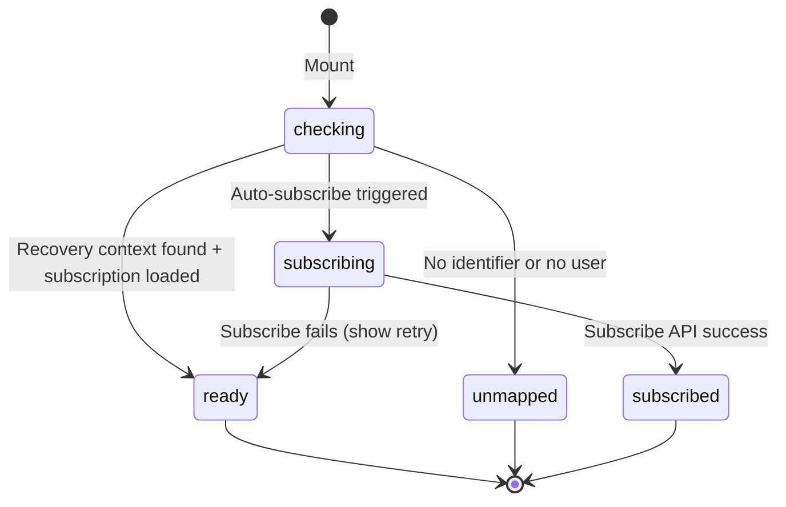

### Recovery Context Lookup Chain

The page tries multiple strategies to find the payment context, ordered by confidence:

1. **orderCode** → `getRecoveryByOrderCode()`
2. **queryTransactionCode** → `getRecoveryByTransactionCode()`
3. **callbackCheckoutToken** → `getRecoveryByCheckoutToken()`
4. **pendingCheckoutToken** → from `getPendingSessionPaymentContext()`
5. **pendingTransactionCode** → from `getPendingSessionPaymentContext()`
6. **sessionId** → `getLatestRecoveryForSessionPayment()`
7. **purpose** → `getLatestRecoveryForUserByPurpose("MENTOR_INTERVIEW")`
8. **latest user** → `getLatestRecoveryForUser()`

### Payment Purpose Redirect

| Purpose            | Primary Redirect                                           |
| ------------------ | ---------------------------------------------------------- |
| `FULLY_PAID`       | `/user?tab=account` ("Return to Account")                  |
| `MENTOR_INTERVIEW` | `/user/mock-interview/history/{sessionId}?payment=success` |

The MENTOR_INTERVIEW redirect uses `window.location.replace()` to avoid back-button loops and automatically clears the pending session payment context.

### Resolution Guard Chain

After the lookup chain finds a recovery context, **4 guard checks** run in sequence. Any failure short-circuits to `unmapped` state:

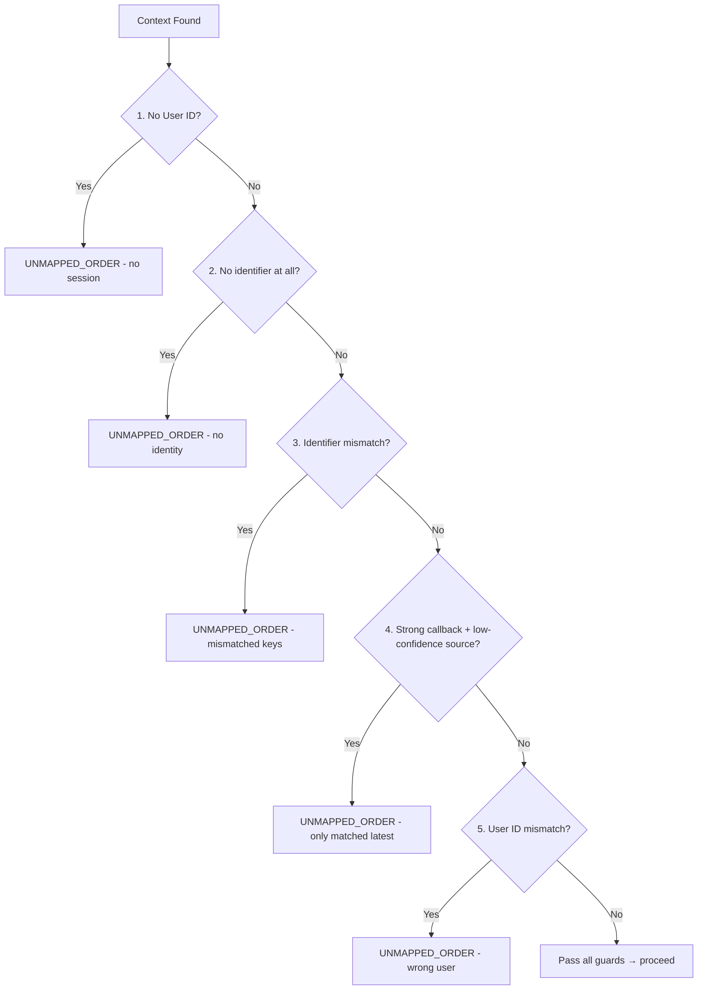

| Guard                            | Detection                                                                                                  | Recovery Action                                                               |
| -------------------------------- | ---------------------------------------------------------------------------------------------------------- | ----------------------------------------------------------------------------- |
| No user session                  | `currentUserId === 0`                                                                                      | Log `UNMAPPED_ORDER` with `source`, `status`, `paid`                          |
| No identifier                    | All of `orderCode`, `queryTransactionCode`, `callbackCheckoutToken`, pending fields, `sessionId` are empty | Log `UNMAPPED_ORDER` with all params                                          |
| Identifier mismatch              | `getCallbackIdentifierMismatch()` returns `hasMismatch: true`                                              | Log with `mismatchedKeys` array                                               |
| Strong callback + low confidence | `hasStrongCallbackIdentifier && isLowConfidenceRecoverySource(recoverySource)`                             | Log with `recoverySource` — prevents false-positive match from weakest lookup |
| User ID mismatch                 | `nextContext.userId !== currentUserId`                                                                     | Log with `expectedUserId` vs `actualUserId`                                   |

**`isLowConfidenceRecoverySource()`** returns `true` only for `"latest-user-recovery"` — the weakest lookup tier. This prevents the case where a callback with `orderCode` accidentally matches a completely different user's latest recovery record.

### Concurrent Resolution Prevention

The page uses **two mechanisms** to prevent duplicate resolution:

1. **`resolveInFlightRef`** (boolean ref) — set `true` at start of `handleResolveOrder()`, reset in `finally` block. Any concurrent call returns immediately.
2. **`autoResolveKeyRef`** (string ref) — stores the last executed `resolveExecutionKey`. If the key hasn't changed, the `useEffect` skips re-execution. Prevents React strict-mode double-mount from running resolution twice.
3. **`resolveExecutionKey`** (computed memo) — a pipe-delimited string of all URL params + pending context + userId. Only changes when actual input changes.

```typescript
const resolveExecutionKey = useMemo(
  () => [currentUserId, orderCode, queryTransactionCode, callbackCheckoutToken,
         status, source, pendingSessionPayment?.sessionId, ...].join("|"),
  [...deps]
);

useEffect(() => {
  if (autoResolveKeyRef.current === resolveExecutionKey) return; // dedup guard
  autoResolveKeyRef.current = resolveExecutionKey;
  void handleResolveOrder();
}, [resolveExecutionKey, handleResolveOrder]);
```

### `isPaidStatus()` — Multi-Value Check

Accepts three payment statuses (case-insensitive):

```typescript
const isPaidStatus = (status: string): boolean => {
  const normalized = status.trim().toUpperCase();
  return normalized === "PAID" || normalized === "SUCCESS" || normalized === "COMPLETED";
};
```

This handles different payment gateway conventions — VNPay returns `PAID`, some Momo flows return `SUCCESS` or `COMPLETED`.

### `isAlreadySubscribedError()` — Pattern Detection

Detects when a subscribe API call indicates the package was already activated:

```typescript
// Matches: 409, "conflict", "already", "da kich hoat", "already active", "already subscribed"
// Also matches the i18n key t("paymentPaymentsuccesspage.activated")
const normalized = error.toLowerCase();
return (
  normalized.includes("409") ||
  normalized.includes("conflict") ||
  normalized.includes("already") ||
  normalized.includes(t("paymentPaymentsuccesspage.activated")) ||
  normalized.includes("da kich hoat") ||
  normalized.includes("already active") ||
  normalized.includes("already subscribed")
);
```

This handles both English backend messages and Vietnamese fallback text from the backend.

### `ACTIVATED_ORDERS_STORAGE_KEY` — Client-Side Idempotency

The page tracks which order codes have been successfully activated in `localStorage`:

```typescript
const ACTIVATED_ORDERS_STORAGE_KEY = "inblue.payment.activated-orders";
```

| Operation                     | Description                                                    |
| ----------------------------- | -------------------------------------------------------------- |
| `getActivatedOrderCodes()`    | Reads `Set<string>` of activated order codes from localStorage |
| `markOrderAsActivated(code)`  | Adds order code to the Set and persists                        |
| `isKnownActivatedOrder` state | Shows violet "Package Activated Previously" banner             |

**Why this exists**: Even if the backend's subscribe API returns an error (e.g., network timeout), the page can detect that the order was already activated by checking this local set before showing a failure state.

### Auto-Subscribe Timing

The auto-subscribe flow is triggered via a separate `useEffect` with **3 timing conditions**:

```typescript
useEffect(() => {
  if (resolveState !== "ready") return;           // 1. Must have completed resolution
  if (!recoveryContext || !paid) return;           // 2. Must have context + paid status
  if (recoveryContext.paymentPurpose !== "FULLY_PAID") return; // 3. Only for FULLY_PAID
  if (recoveryContext.status === "SUBSCRIBE_SUCCESS") {        // Already subscribed?
    setResolveState("subscribed");
    return;
  }
  const key = (recoveryContext.orderCode || recoveryContext.supportCode || "").trim();
  if (!key || autoSubscribeKey === key) return;    // 4. Key-based dedup
  // Trigger subscribe via setTimeout(0) to batch with render
  const timerId = window.setTimeout(() => {
    setAutoSubscribeKey(key);
    void handleConfirmSubscribe();
  }, 0);
  return () => window.clearTimeout(timerId);
}, [...]);
```

The `setTimeout(0)` ensures the subscribe call is batched with the render cycle (React 19 concurrent mode safe).

### MENTOR_INTERVIEW Redirect

When the recovery context has `paymentPurpose === "MENTOR_INTERVIEW"`, the page does NOT show the subscribe flow. Instead:

```typescript
if (updatedContext.paymentPurpose === "MENTOR_INTERVIEW") {
  const targetSessionId = updatedContext.sessionId || pendingSessionPayment?.sessionId;
  if (targetSessionId) {
    const params = new URLSearchParams();
    params.set("payment", "success");
    if (updatedContext.orderCode) params.set("orderCode", updatedContext.orderCode);
    clearPendingSessionPaymentContext();
    window.location.replace(`/user/mock-interview/history/${targetSessionId}?${params.toString()}`);
    return; // Page never renders success UI — full redirect
  }
  // Fallback: stay on page with error if sessionId is missing
  setResolveError(t("paymentPaymentsuccesspage.paymentConfirmedNotFound"));
}
```

Uses `window.location.replace()` (not `navigate()`) to avoid browser back-button returning to the success page.

### User ID Mismatch Detection

After finding a recovery context, the page cross-validates the user:

```typescript
if (nextContext.userId !== currentUserId) {
  addPaymentSupportLog({ ..., status: "UNMAPPED_ORDER", message: "...", payload: {
    expectedUserId: nextContext.userId,
    actualUserId: currentUserId,
  }});
  setResolveState("unmapped");
  setResolveError(t("adminSessionmanagement.paymentInformation"));
  return;
}
```

This prevents a scenario where User A's payment callback URL is opened by User B (e.g., shared link) from incorrectly modifying User B's subscription.

---

## 4. PaymentCancelPage (`src/pages/Payment/PaymentCancelPage.tsx`)

### Cancel Chain

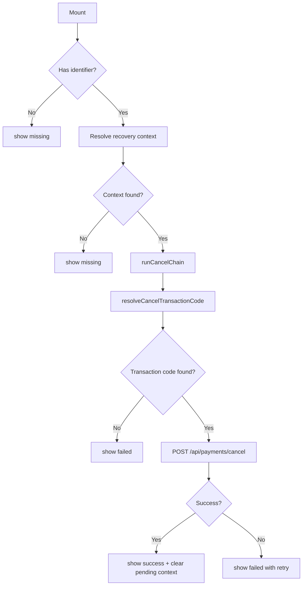

### Idempotency

The cancel page handles already-processed cancellations gracefully:

- Detects errors containing "not found", "404", "already processed", "already cancelled"
- Treats these as idempotent success

---

## 5. Payment Recovery System (`src/lib/payment-recovery.ts`)

### Storage

Uses `localStorage` with two keys:

| Key                                   | Purpose                  | TTL      |
| ------------------------------------- | ------------------------ | -------- |
| `inblue.payment.recovery-contexts.v1` | Recovery context records | 24 hours |
| `inblue.payment.support-logs.v1`      | Support/debug logs       | 24 hours |
| `inblue.session-payment.pending`      | Pending session payment  | 2 hours  |
| `inblue.payment.paid-status-sync`     | Paid status cache        | 4 hours  |

### Retention

Records expire after **24 hours** (`PAYMENT_RECOVERY_RETENTION_MS = 24 * 60 * 60 * 1000`). Expired records are filtered out during `readRecoveryRecords()` on every read (lazy pruning, not a separate cleanup function). Session payment context has a stricter **2-hour TTL**.

### Upsert Deduplication Chain

`upsertPaymentRecoveryContext()` uses a **5-level dedup chain** to find existing records before creating new ones. This prevents duplicate recovery records for the same payment:

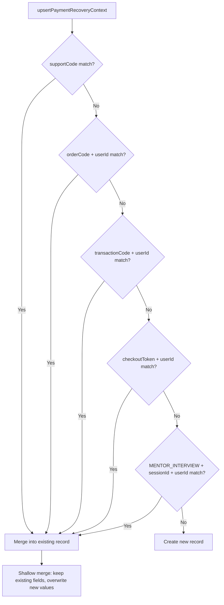

**Why `supportCode` is checked first**: It's the most specific identifier (unique per payment flow). The `orderCode + userId` check requires both fields to match, preventing cross-user collisions. The MENTOR_INTERVIEW + sessionId tier handles the case where the same session's payment is retried.

**Merge behavior**: When an existing record is found, it's shallow-merged — new values overwrite existing ones only if they're truthy. Empty/null values from the update input don't overwrite the existing record's values.

### Record Schema

```typescript
interface PaymentRecoveryContext {
  id: string; // Auto-generated: PAY-{timestamp}-{random}
  supportCode: string; // Human-readable support code
  orderCode?: string;
  transactionCode?: string;
  checkoutToken?: string;
  userId: number;
  planId?: number;
  planName?: string;
  amount?: number; // Amount formatted for display (e.g., "300,000đ")
  paymentPurpose?: "FULLY_PAID" | "MENTOR_INTERVIEW";
  sessionId?: number; // For MENTOR_INTERVIEW purpose
  checkoutUrl?: string;
  status: PaymentRecoveryStatus;
  note?: string;
  errorCode?: string;
  createdAt: string;
  updatedAt: string;
}
```

### Support Code Format

Each recovery record gets a `supportCode` in format `SUP-{orderSuffix}-{timestamp}` when an `orderCode` exists, or `SUP-{timestamp}` when not. Example: `SUP-ABC123-LX3K5F2`. The `orderCode` suffix (last 6 chars) aids human identification. The code is generated once at creation and never changes.

### URL Extraction Helpers

The module provides URL parsing helpers used by the recovery system:

| Function                          | Extracts         | Query Keys Tried                                                       |
| --------------------------------- | ---------------- | ---------------------------------------------------------------------- |
| `extractOrderCodeFromUrl()`       | Order code       | `orderCode`, `order_code`                                              |
| `extractTransactionCodeFromUrl()` | Transaction code | `transactionCode`, `transaction_code`                                  |
| `extractCheckoutTokenFromUrl()`   | Checkout token   | `id`, `checkoutId`, `checkout_id` + **last URL path segment** fallback |

The checkout token extraction has a **path-segment fallback**: if no query param matches, it takes the last non-empty segment of the URL path (e.g., `/checkout/abc123` → `abc123`).

### Amount Formatting

The `amount` field stores a **formatted string** (e.g., `"300,000đ"`) using the project's `formatCurrency()` utility. This ensures consistent display across the recovery UI regardless of locale.

### Status Lifecycle

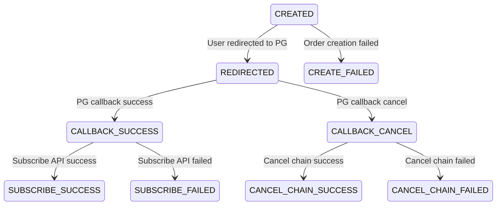

---

## 6. Payment Callback Utilities (`src/lib/payment-callback.ts`)

### Key Functions

| Function                                | Purpose                                          |
| --------------------------------------- | ------------------------------------------------ |
| `isCancelCallbackSignal()`              | Detect cancel status from URL params             |
| `resolveCancelTransactionCode()`        | Find the right transaction code for cancel       |
| `getCallbackIdentifierMismatch()`       | Detect mismatched order/transaction/checkout IDs |
| `shouldUseOrderCodeAsTransactionCode()` | Fallback: use orderCode when no tx code          |
| `isLowConfidenceRecoverySource()`       | Identify weakest recovery lookup tiers           |

### `isCancelCallbackSignal()` — Multi-Signal Detection

Determines if a callback URL indicates a **cancel** or **failed** payment using 3 independent signals:

| Signal                          | Detection Logic                                                         | Example Values            |
| ------------------------------- | ----------------------------------------------------------------------- | ------------------------- |
| `callbackCheckoutToken` present | Any non-empty checkout token                                            | `"chk_abc123"`            |
| `status` is cancel status       | Matches: `CANCELLED`, `CANCELED`, `CANCEL`, `FAILED` (case-insensitive) | `"cancelled"`, `"failed"` |
| `cancelFlag` is truthy          | Matches: `"1"`, `"true"`, `"yes"`, `"y"`, `true`                        | `"true"`, `1`             |

The signal uses **OR logic** — any one of the three being truthy triggers the cancel flow.

### `resolveCancelTransactionCode()` — 5-Level Priority Chain

When a cancel callback arrives, the transaction code is needed for the `POST /api/payments/cancel` API. It resolves through this priority chain:

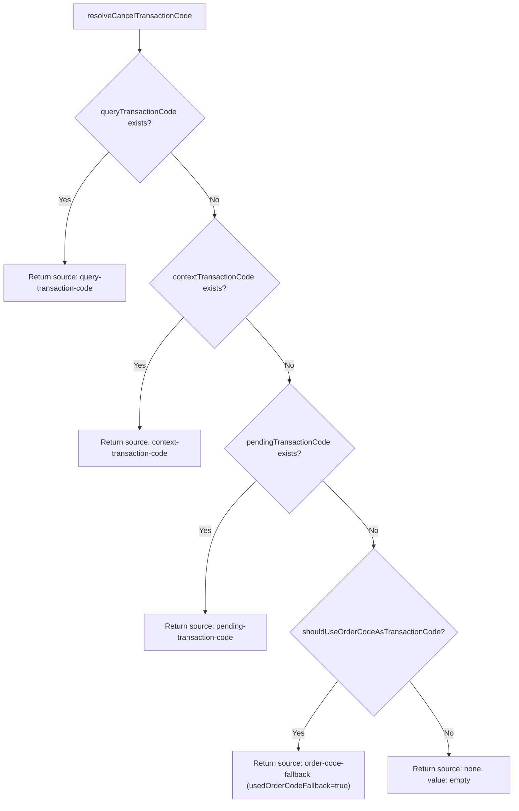

The `orderCode` fallback is **only used** when `shouldUseOrderCodeAsTransactionCode()` returns true — which requires: (1) no other transaction code found, (2) orderCode exists, and (3) `isCancelCallbackSignal()` is true. This prevents incorrectly using orderCode as a transaction code for non-cancel callbacks.

### `getCallbackIdentifierMismatch()` — 3-Key Cross-Validation

Compares callback identifiers against recovery context identifiers:

```typescript
interface CallbackIdentifierMismatch {
  hasMismatch: boolean;
  mismatchedKeys: Array<"orderCode" | "transactionCode" | "checkoutToken">;
}
```

Each key is only checked if **both** the callback and context have non-empty values for that key. An empty value in either side is treated as "unknown" (not a mismatch). This handles the common case where a callback only provides 1-2 identifiers while the context may have more.

### `isLowConfidenceRecoverySource()` — Confidence Classification

Returns `true` only for `"latest-user-recovery"` — the weakest tier in the lookup chain. This is used by PaymentSuccessPage (and PaymentCancelPage) to prevent false-positive matches:

```typescript
export const isLowConfidenceRecoverySource = (source: PaymentRecoveryLookupSource): boolean => {
  return source === "latest-user-recovery";
};
```

**Security implication**: If a callback arrives with a strong identifier (`orderCode`/`transactionCode`/`checkoutToken`) but the only recovery match was via `latest-user-recovery`, the page treats it as `UNMAPPED_ORDER` rather than risk applying the wrong recovery context.

---

## 7. Session Payment Context (`src/lib/session-payment-context.ts`)

Tracks pending payment for mentor interview sessions:

```typescript
interface SessionPaymentContext {
  sessionId: number;
  userId?: number;
  paymentPurpose: "MENTOR_INTERVIEW";
  checkoutUrl?: string;
  checkoutToken?: string;
  orderCode?: string;
  transactionCode?: string;
  createdAt: string;
}
```

- Stored at: `inblue.session-payment.pending`
- **Max age**: 2 hours
- Extracts `checkoutToken`, `orderCode`, `transactionCode` from checkout URL at save time

---

## 8. Support Logging

Every significant event is logged via `addPaymentSupportLog()`:

| Status             | When                                           |
| ------------------ | ---------------------------------------------- |
| `UNMAPPED_ORDER`   | No user session or no identifiers              |
| `CALLBACK_SUCCESS` | Callback received but subscribe not yet called |
| `CALLBACK_CANCEL`  | Cancel callback received                       |
| `SUBSCRIBE_FAILED` | Subscribe API returned error                   |

Logs include `supportCode` for customer support traceability.

---

## 9. SessionManager Payment Operations (`src/services/session.manager.ts`)

The `SessionManager` contains significant payment-related resilience logic that operates independently of the client-side recovery system (§5). These are the actual API-calling methods that the user-facing pages invoke.

### 9.1 — `makePayment()` — Checkout URL Generation

Uses `parseAs: "text"` because the backend may return the checkout URL as either a raw string or a JSON object — the response type is unpredictable:

```typescript
async makePayment(sessionId: number): Promise<ApiResponse<string>> {
  const response = await fetchClient.GET("/api/sessions/make-payment", {
    params: { query: { sessionId } },
    parseAs: "text",  // Response may be string OR JSON
  });

  const checkoutUrl = extractCheckoutUrl(response.data);
  // Validates URL with isLikelyHttpUrl() before returning
}
```

### 9.2 — `extractCheckoutUrl()` — Multi-Field URL Extraction

Handles the backend's inconsistent payment response shapes by probing multiple fields recursively:

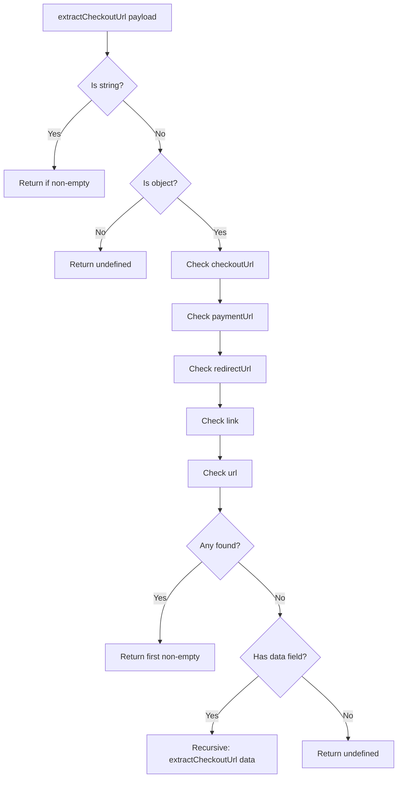

The field priority order: `checkoutUrl` → `paymentUrl` → `redirectUrl` → `link` → `url` → recursive `data` nesting. This handles different backend versions and payment gateway response formats.

### 9.3 — `markSessionAsPaid()` — FE-Side Payment Sync

This is a **temporary FE resilience path** while the backend lacks a dedicated `confirm-payment` endpoint. It forces a session to PAID by reading the session, checking its status, and updating it via PUT:

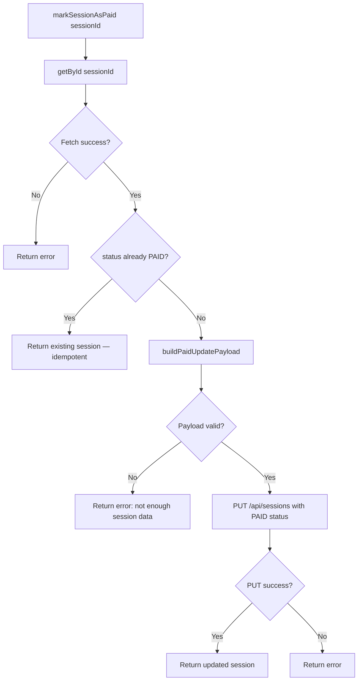

**Idempotency**: If the session is already `PAID`, the method returns the existing session without making a PUT call. This prevents redundant updates during concurrent retries.

### 9.4 — `buildPaidUpdatePayload()` — Null-Safe Payload Construction

Constructs the PAID status update from session data with defensive null checks on every field:

```typescript
private buildPaidUpdatePayload(sessionData: Session, transactionCode?: string): Session | null {
  const userId = toPositiveInteger(sessionData.userId);
  const mentorId = toPositiveInteger(sessionData.userId2);
  const sessionId = toPositiveInteger(sessionData.id);

  if (!userId || !mentorId || !sessionId) {
    return null;  // Refuses to build incomplete payloads
  }

  return {
    id: sessionId,
    userId, userId2: mentorId,
    status: "PAID",
    joinTime: asNonEmptyString(sessionData.joinTime) || formatToVietnamISOString(new Date()),
    roomName: asNonEmptyString(sessionData.roomName) || `session-${sessionId}`,
    totalPrice: toFiniteInteger(sessionData.totalPrice) ?? 0,
    transactionCode: asNonEmptyString(transactionCode) || asNonEmptyString(sessionData.transactionCode),
  };
}
```

Returns `null` (not a partial object) if critical fields are missing — callers must handle this as an error.

### 9.5 — `markSessionAsPaidWithRetry()` — Exponential Backoff

Wraps `markSessionAsPaid()` with retry logic for transient failures:

```typescript
async markSessionAsPaidWithRetry(
  sessionId: number, transactionCode?: string, maxAttempts = 3
): Promise<ApiResponse<Session>> {
  for (let attempt = 1; attempt <= attempts; attempt++) {
    const result = await this.markSessionAsPaid(sessionId, transactionCode);
    if (result.success) return result;
    if (attempt < attempts) await sleep(attempt * 500);  // 500ms, 1000ms backoff
  }
  return { success: false, error: lastError };
}
```

**Backoff schedule**: `1 × 500ms = 500ms`, `2 × 500ms = 1000ms` (total 3 attempts over ~1.5s).

**Called from 4 pages**: `InterviewHistoryPage`, `SessionHistoryPage`, `SessionDetailPage`, `SessionRoomPage` — each page triggers the retry as part of the paid-status-sync reconciliation flow (see `06_Utilities.md` §10). `SessionDetailPage` also has a **payment callback polling loop** that calls this function up to 12 times at 5s intervals after `?payment=success` (see §10 below).

### 9.6 — `delete()` — Cancel Via REJECTED Status

The `delete()` method does **NOT** use a DELETE HTTP verb. Instead, it sends `PUT /api/sessions` with `status: "REJECTED"`:

```typescript
async delete(_id: string | number): Promise<ApiResponse<void>> {
  // Use REJECTED to cancel session and avoid DB constraint violation 'session_status_check'
  const sessionData: Session = { id: Number(_id), status: "REJECTED" };
  await fetchClient.PUT("/api/sessions", { body: sessionData });
}
```

**Why**: The backend has a DB constraint (`session_status_check`) that prevents actual row deletion. Setting `status: "REJECTED"` marks the session as cancelled without violating the constraint. This is a semantic trick — `delete` means "soft-cancel" at the business level.

### 9.7 — Type Coercion Helpers

The SessionManager exports several helper functions for safe type coercion, used throughout `create()` and `buildPaidUpdatePayload()`:

| Helper                                | Purpose                                                                      |
| ------------------------------------- | ---------------------------------------------------------------------------- |
| `toFiniteInteger(value)`              | → `number \| undefined`. Parses to finite integer via `Math.round()`         |
| `toPositiveInteger(value)`            | → `number \| undefined`. Like `toFiniteInteger` but rejects ≤ 0              |
| `toBooleanOrDefault(value, fallback)` | → `boolean`. Returns `value` if boolean, else `fallback`                     |
| `toRecordingMode(value)`              | → `"local" \| "cloud"`. Accepts only these two values, defaults to `"cloud"` |
| `asNonEmptyString(value)`             | → `string \| undefined`. Trims whitespace, returns `undefined` if empty      |
| `isLikelyHttpUrl(value)`              | → `boolean`. Regex check for `https?://` prefix                              |
| `sleep(ms)`                           | → `Promise<void>`. `setTimeout` wrapped in a Promise                         |

### 9.8 — `create()` — Dual-Path Session Creation

The `create()` method accepts two different input shapes with a type guard:

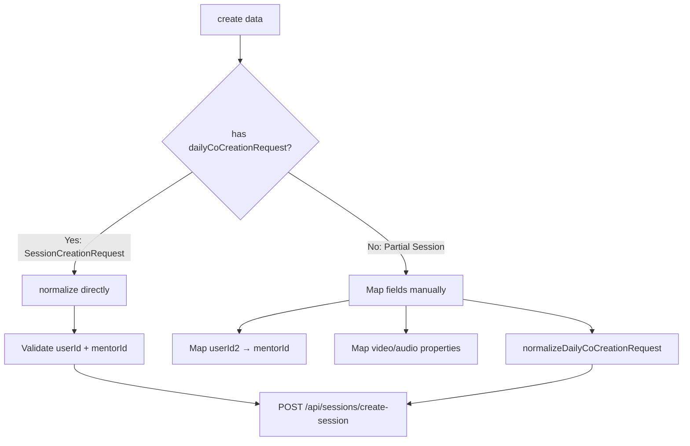

**Path A** (`SessionCreationRequest`): Direct normalization with `normalizeDailyCoCreationRequest()`. Used by `SessionRoomPage`.

**Path B** (`Partial<Session>`): Field mapping from the legacy `Session` shape — `userId2` → `mentorId`, `start_video_off`/`start_audio_off`/etc. → nested `properties` object. Used by admin/staff session management UIs.

Both paths converge on the same `POST /api/sessions/create-session` endpoint.

---

## 10. SessionDetailPage Payment Callback Flow (`src/pages/User/MockInterview/SessionDetailPage.tsx`)

The `SessionDetailPage` is the **landing page** for MENTOR_INTERVIEW payments (redirected from `PaymentSuccessPage` §3). It contains its own payment creation, callback polling, and paid-status sync reconciliation logic that operates independently of the subscription payment flow.

### 10.1 — Payment Creation Chain (`handlePaySessionWithPayOS`)

When the user clicks "Pay" on a SCHEDULED session, the page executes a 6-step chain:

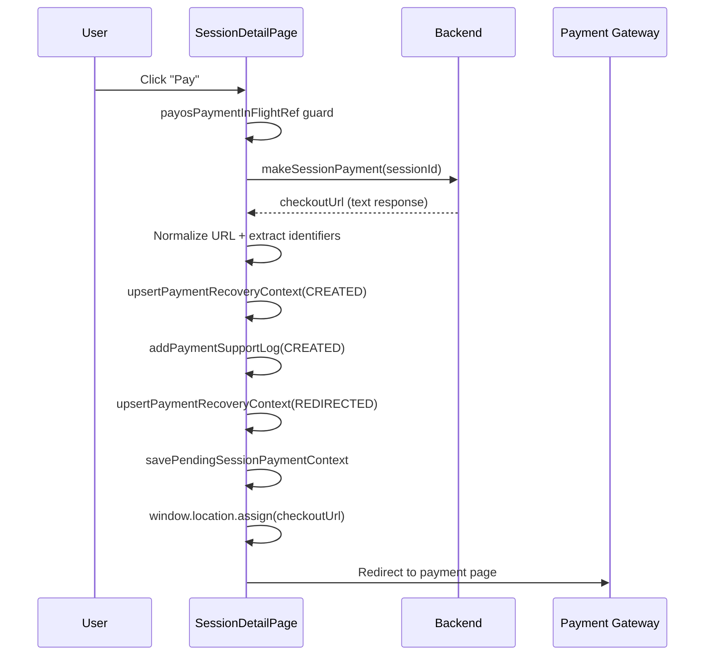

**Key difference from `InterviewHistoryPage`**: The `InterviewHistoryPage` simply calls `makeSessionPayment` and redirects (`window.location.assign(checkoutUrl)`). Both `SessionDetailPage` and `SessionHistoryPage` create the **full recovery context chain** (CREATED → REDIRECTED) with URL extraction, support logging, and pending session payment context. The `InterviewHistoryPage` skips all recovery infrastructure because it's a lightweight list page — recovery is handled when the user lands on `SessionDetailPage` after the callback redirect.

**Identifier extraction**: After receiving the checkout URL, the page extracts 3 URL-based identifiers plus the payment amount from the session:

```typescript
const normalizedCheckoutUrl = new URL(checkoutUrl, window.location.origin).toString();
const orderCode = extractOrderCodeFromUrl(normalizedCheckoutUrl) || undefined;
const transactionCode = extractTransactionCodeFromUrl(normalizedCheckoutUrl) || undefined;
const checkoutToken = extractCheckoutTokenFromUrl(normalizedCheckoutUrl) || undefined;
// Amount from session, NOT from URL — guarded against non-number/negative
const paymentAmount =
  typeof session.totalPrice === "number" && session.totalPrice > 0 ? session.totalPrice : undefined;
```

**Two-step recovery context creation**: The page calls `upsertPaymentRecoveryContext` twice — once with `status: "CREATED"` and once with `status: "REDIRECTED"` — reusing the `supportCode` from the first call:

```typescript
const createdRecovery = upsertPaymentRecoveryContext({
  orderCode,
  transactionCode,
  checkoutToken,
  userId: Number(user.id),
  amount: paymentAmount,
  paymentPurpose: "MENTOR_INTERVIEW",
  sessionId: session.id,
  checkoutUrl: normalizedCheckoutUrl,
  status: "CREATED",
});
addPaymentSupportLog({
  supportCode: createdRecovery.supportCode,
  /* ... */ status: "CREATED",
});
// Second call reuses supportCode — same recovery record, updated status
const redirectedRecovery = upsertPaymentRecoveryContext({
  supportCode: createdRecovery.supportCode, // ← reuses first call's ID
  orderCode,
  transactionCode,
  checkoutToken,
  userId: createdRecovery.userId,
  amount: createdRecovery.amount,
  paymentPurpose: "MENTOR_INTERVIEW",
  sessionId: session.id,
  checkoutUrl: normalizedCheckoutUrl,
  status: "REDIRECTED",
});
```

**UNMAPPED_ORDER edge case**: If `transactionCode` extraction fails (empty/falsy), the page logs an additional `UNMAPPED_ORDER` support entry with `recoveryStrategy: "orderCode-fallback-guarded"`. This signals to support staff that the payment gateway returned a URL without a recognizable transaction code:

```typescript
if (!transactionCode) {
  addPaymentSupportLog({
    supportCode: redirectedRecovery.supportCode,
    orderCode,
    checkoutToken,
    userId: redirectedRecovery.userId,
    amount: redirectedRecovery.amount,
    paymentPurpose: "MENTOR_INTERVIEW",
    sessionId: session.id,
    status: "UNMAPPED_ORDER",
    payload: {
      orderCode: orderCode || null,
      checkoutToken: checkoutToken || null,
      recoveryStrategy: "orderCode-fallback-guarded",
    },
  });
}
```

**Error handling (catch block)**: If `makeSessionPayment` throws, the page logs a `CREATE_FAILED` support entry with the error message, then lets the `useMakeSessionPayment` hook's built-in error toast handle the user notification. The `finally` block always resets `payosPaymentInFlightRef` and `setIsCreatingPayment`:

```typescript
} catch (error) {
  addPaymentSupportLog({
    userId: Number(user.id),
    amount: typeof session?.totalPrice === "number" && session.totalPrice > 0
      ? session.totalPrice : undefined,
    paymentPurpose: "MENTOR_INTERVIEW", sessionId: session?.id,
    status: "CREATE_FAILED",
    payload: { error: error instanceof Error ? error.message : "unknown" },
  });
} finally {
  payosPaymentInFlightRef.current = false;
  setIsCreatingPayment(false);
}
```

**Concurrency guard**: `payosPaymentInFlightRef` (boolean ref) prevents double-click during the async payment creation. Shows a "generating payment link" info toast if already in-flight. The `finally` block guarantees the ref is always reset, even on error.

### 10.2 — Payment Callback Polling (`paymentState === "success"`)

When the user returns from the payment gateway with `?payment=success` in the URL, the page **polls** for the backend to process the webhook.

**Pre-polling guard**: Before starting the polling loop, the effect checks if the session is **already PAID** (e.g., webhook processed during the redirect). If so, it immediately shows a success toast and navigates away — no polling needed:

```typescript
if (session.status === "PAID") {
  toast.success(t("userMockinterview.paymentForTheInterviewSession"));
  navigate(`/user/mock-interview/history/${currentSessionId}`, { replace: true });
  return;
}
```

**Polling loop execution flow** — each `pollStatus()` call runs this sequence:

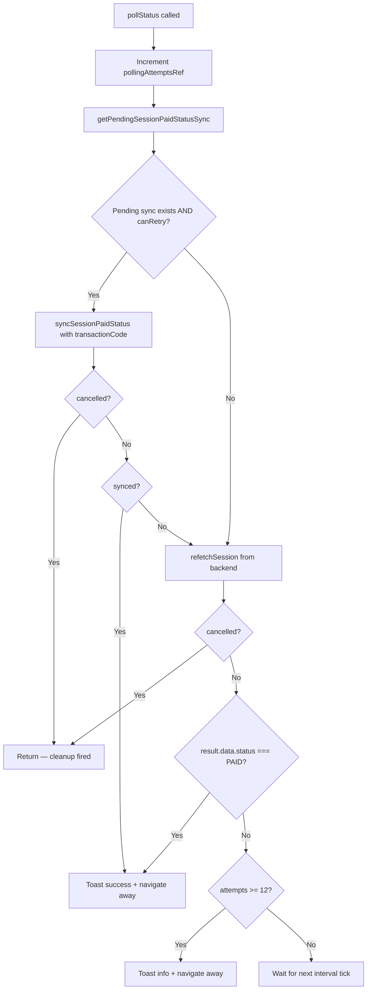

**Key detail — conditional sync attempt**: The polling does NOT blindly call `syncSessionPaidStatus`. It first checks `getPendingSessionPaidStatusSync()` AND `canRetryPendingSessionPaidStatusSync()`. Only if a retriable pending sync exists does it attempt the FE-side sync, passing the `transactionCode` from the pending sync record. If no pending sync exists (or it's exhausted retries), it skips directly to `refetchSession()`.

```typescript
const pendingSync = getPendingSessionPaidStatusSync(currentSessionId, Number(user.id));
if (pendingSync && canRetryPendingSessionPaidStatusSync(pendingSync)) {
  const synced = await syncSessionPaidStatus(currentSessionId, pendingSync.transactionCode, {
    silent: true,
  });
  if (cancelled) return;
  if (synced) {
    setIsPollingPayment(false);
    toast.success(t("userMockinterview.paymentForTheInterviewSession"));
    navigate(`/user/mock-interview/history/${currentSessionId}`, { replace: true });
    return;
  }
}
// Fallback: check backend directly
const result = await refetchSession();
if (cancelled) return;
if (result.data?.status === "PAID") {
  /* success + navigate */
}
if (pollingAttemptsRef.current >= 12) {
  /* exhausted + navigate */
}
```

**Why polling exists**: The payment gateway sends a webhook to the backend, which updates the session status to PAID. The frontend doesn't receive a push notification — it must poll. The 5s × 12 attempts (60s) window is long enough for webhook processing but short enough to not leave the user staring at a blank page.

**Cancellation guard**: A local `cancelled` variable (set to `true` in the cleanup function) is checked after every `await` — both after `syncSessionPaidStatus` and after `refetchSession`. This prevents state updates on an unmounted component if the user navigates away during polling.

**Cleanup**: The `useEffect` returns a cleanup function:

```typescript
return () => {
  cancelled = true;
  setIsPollingPayment(false);
  window.clearInterval(intervalId);
};
```

### 10.3 — Payment Cancel Handling (`paymentState === "cancelled"`)

```typescript
if (paymentState === "cancelled") {
  if (!hasHandledCancelledParamRef.current) {
    hasHandledCancelledParamRef.current = true;
    toast.info(t("userMockinterview.youHaveCanceledYourPayment"));
  }
  return; // No further action — session stays SCHEDULED
}
```

The `hasHandledCancelledParamRef` ensures the toast shows only once, even if React strict-mode double-mounts the component.

### 10.4 — Paid-Status Sync Reconciliation (non-callback)

Separate from the callback polling, the page also has a `useEffect` that runs on every session status change. Its dependency array is `[session?.id, session?.status, syncSessionPaidStatus, user?.id]`:

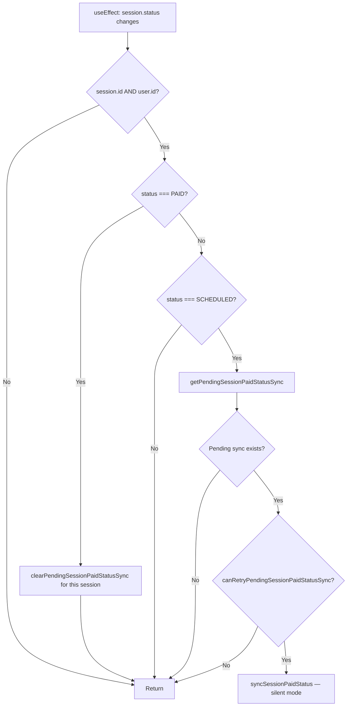

**PAID cleanup**: If the session is already PAID (webhook processed before page load), the effect clears the pending sync record. This is a **read-then-cleanup** pattern — the sync succeeded (via backend webhook), so the FE-side retry record is no longer needed.

**SCHEDULED-only activation**: The sync is only attempted when `session.status === 'SCHEDULED'`. Any other status (DRAFT, COMPLETED, REJECTED, etc.) skips the sync entirely.

This reconciliation runs independently of the callback polling — it handles the case where the user navigates to the detail page directly (not from a payment callback) and a pending sync exists from a previous failed attempt.

### 10.5 — `syncSessionPaidStatus` — Shared Sync Callback

Both the callback polling (§10.2) and the reconciliation (§10.4) use the same `syncSessionPaidStatus` callback:

```typescript
const syncSessionPaidStatus = useCallback(
  async (
    targetSessionId: number,
    transactionCode?: string,
    options?: { silent?: boolean }
  ): Promise<boolean> => {
    if (!user?.id || paidStatusSyncInFlightRef.current) return false;
    paidStatusSyncInFlightRef.current = true;
    setIsRecoveringPaidStatus(true);
    try {
      markPendingSessionPaidStatusSyncRetried(targetSessionId, Number(user.id));
      const syncResult = await sessionManager.markSessionAsPaidWithRetry(
        targetSessionId,
        transactionCode,
        3
      );
      if (!syncResult.success) return false;
      clearPendingSessionPaidStatusSync(targetSessionId, Number(user.id));
      await refetchSession();
      if (!options?.silent) toast.success(t("userMockinterview.sessionStatusSyncedToPaid"));
      return true;
    } finally {
      paidStatusSyncInFlightRef.current = false;
      setIsRecoveringPaidStatus(false);
    }
  },
  [refetchSession, user?.id, t]
);
```

**Concurrency guard**: `paidStatusSyncInFlightRef` prevents overlapping sync calls. If a sync is already running, subsequent calls return `false` immediately.

**Silent mode**: The reconciliation (§10.4) uses `silent: true` to suppress the success toast — the user didn't explicitly trigger a sync. The callback polling (§10.2) also uses `silent: true` because it shows its own success toast after navigation.
