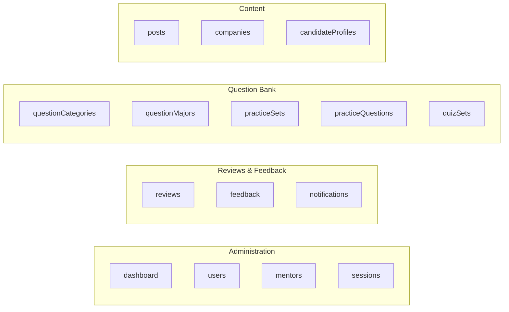
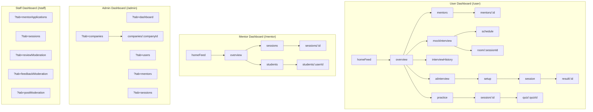

# Role-Based Dashboard Features

> **Source:** `src/pages/Admin/`, `src/pages/Staff/`, `src/pages/Mentor/`, `src/pages/User/`  
> **Last Synced:** 2026-06-05

---

## 1. Dashboard Shell Architecture

All four role dashboards share a common shell pattern using shared components.

### Shared Components Used

| Component                | Source                     | Purpose                        |
| ------------------------ | -------------------------- | ------------------------------ |
| `DashboardChromeTabs`    | `components/shared/`       | Chrome-style tab bar           |
| `DashboardSidebar`       | `components/shared/`       | Collapsible navigation sidebar |
| `DashboardSidebarToggle` | `components/shared/`       | Sidebar collapse button        |
| `SettingsModal`          | `components/shared/`       | User settings dialog           |
| `ScrollToTopButton`      | `components/shared/`       | Floating scroll-to-top         |
| `DashboardBreadcrumb`    | `components/shared/`       | Page breadcrumbs               |
| `NotificationBell`       | `components/notification/` | Notification bell badge        |

### Tab State Management

All dashboards use `useTabsState` hook:

```typescript
const { activeTab, openTabs, setActiveTab, closeTab, resetTabsTo } = useTabsState({
  storageKey: "admin", // localStorage key
  defaultTab: "dashboard", // Default tab
  availableTabs: availableTabs, // Valid tab definitions
});
```

Tab state is synced to URL via `?tab=` query parameter.

---

## 2. Admin Dashboard

**Route:** `/admin` (single route, all tabs render inline)  
**Shell:** `AdminDashboardPage` with `DashboardChromeTabs` + `DashboardSidebar`

### Tab Definitions (16 tabs)



### Tab → Component Mapping

| Tab Key              | Component                        | Description                   |
| -------------------- | -------------------------------- | ----------------------------- |
| `dashboard`          | `DashboardOverviewPage`          | Charts, stats, metrics        |
| `users`              | `UserManagementPage`             | User CRUD                     |
| `mentors`            | `MentorManagementPage`           | Mentor approval/management    |
| `sessions`           | `SessionManagementPage`          | All interview sessions        |
| `reviews`            | `ReviewManagementPage`           | Mentor review moderation      |
| `feedback`           | `FeedbackManagementPage`         | Candidate feedback moderation |
| `notifications`      | `NotificationManagementPage`     | Send/manage notifications     |
| `questionCategories` | `QuestionCategoryManagementPage` | Question category CRUD        |
| `questionMajors`     | `QuestionMajorManagementPage`    | Major-specific questions      |
| `practiceSets`       | `PracticeSetManagementPage`      | Practice set management       |
| `practiceQuestions`  | `PracticeQuestionManagementPage` | Question management           |
| `quizSets`           | `QuizSetManagementPage`          | Quiz set management           |
| `posts`              | `PostManagementPage`             | Community post moderation     |
| `companies`          | `CompanyManagementPage`          | Company/job management        |
| `candidateProfiles`  | `CandidateProfileManagementPage` | Candidate profile management  |

### Special Behavior

- **Deep link:** `/admin/companies/:companyId` → auto-switches to `companies` tab
- **Close All Tabs:** Resets to single `dashboard` tab
- **Sidebar:** Collapsible, with 4 menu groups matching tab categories
- **DEV validation:** Warns in console if tab/menu configuration has mismatches

### Sidebar Menu Groups

```
Administration     → dashboard, users, mentors, sessions
Reviews & Feedback → reviews, feedback, notifications
Question Bank      → questionCategories, questionMajors, practiceSets, practiceQuestions, quizSets
Content            → posts, companies, candidateProfiles
```

---

## 3. Staff Dashboard

**Route:** `/staff` (single route, tabs render inline)  
**Shell:** `StaffDashboardPage` with `DashboardChromeTabs` + `DashboardSidebar`

### Tab Definitions (5 tabs)

| Tab Key              | Component                | Description                  |
| -------------------- | ------------------------ | ---------------------------- |
| `mentorApplications` | `MentorApplicationsPage` | Process mentor registrations |
| `sessions`           | `SessionProcessingPage`  | Manage interview sessions    |
| `reviewModeration`   | `ReviewModerationPage`   | Moderate mentor reviews      |
| `feedbackModeration` | `FeedbackModerationPage` | Moderate candidate feedback  |
| `postModeration`     | `PostModerationPage`     | Moderate community posts     |

### Sidebar Menu Groups

```
Profession   → mentorApplications, sessions
Censorship   → reviewModeration, feedbackModeration, postModeration
```

### Unique Features

- Green-themed sidebar logo (`bg-green-600`)
- **Open Tab menu**: Can open tabs via ChromeTabs context menu
- Tabs are dynamically added/closed (not pre-opened like Admin)

---

## 4. Mentor Dashboard

**Route:** `/mentor/*` (nested routes via `<Outlet />`)  
**Shell:** `MentorDashboardPage` with `DashboardSidebar` + breadcrumb + `NotificationBell`

### Tab Definitions (9 tabs)

| Tab Key         | Component                 | Description        |
| --------------- | ------------------------- | ------------------ |
| `homeFeed`      | `MentorHomeFeedPage`      | Community feed     |
| `overview`      | `MentorOverviewPage`      | Dashboard overview |
| `sessions`      | `MentorSessionsPage`      | Session management |
| `students`      | `StudentsListPage`        | Student list       |
| `reviews`       | `MentorReviewsPage`       | Reviews received   |
| `feedback`      | `GivenFeedbackListPage`   | Feedback given     |
| `notifications` | `MentorNotificationsPage` | Notifications      |
| `messenger`     | `MessengerPage`           | Real-time chat     |
| `account`       | `MentorAccountPage`       | Account settings   |

### Sidebar Menu Groups

```
Home          → homeFeed
Profession    → overview, sessions, students, reviews, feedback
Account       → notifications, messenger, account
```

### Unique Features

- **Breadcrumb**: Uses `useDashboardBreadcrumb()` + `getDashboardTabFromPath()` for nested route breadcrumbs
- **Nested routing**: Uses React Router `<Outlet />` for sub-pages (`sessions/:sessionId`, etc.)
- **Notification bell**: Integrated directly in header
- Blue-themed sidebar logo (`bg-primary`)

---

## 5. User Dashboard

**Route:** `/user/*` (nested routes via `<Outlet />`)  
**Shell:** `UserDashboardPage` with `DashboardSidebar` + breadcrumb + `NotificationBell`

### Tab Definitions (13 tabs)

| Tab Key              | Component                | Description                   |
| -------------------- | ------------------------ | ----------------------------- |
| `homeFeed`           | `HomeFeedPage`           | Community feed                |
| `overview`           | `OverviewPage`           | Dashboard overview            |
| `mentors`            | `MentorListPage`         | Browse mentors                |
| `mockInterview`      | `MockInterviewListPage`  | Book mock interviews          |
| `interviewHistory`   | `SessionHistoryPage`     | Past interview sessions       |
| `applicationHistory` | `ApplicationHistoryPage` | Job applications              |
| `feedback`           | `UserFeedbackListPage`   | Feedback from mentors         |
| `aiInterview`        | `AIInterviewListPage`    | AI interview sessions         |
| `practice`           | `PracticeSetsPage`       | Practice question sets        |
| `practiceQuestions`  | `PracticeQuestionsPage`  | Individual practice questions |
| `notifications`      | `UserNotificationsPage`  | Notifications                 |
| `messenger`          | `MessengerPage`          | Real-time chat                |
| `account`            | `AccountPage`            | Account settings              |

### Sidebar Menu Groups

```
Home         → homeFeed
Interview    → overview, mentors, mockInterview, interviewHistory, applicationHistory, feedback
Training     → aiInterview, practice, practiceQuestions
Account      → notifications, messenger, account
```

### Unique Features

- **Deepest nested routing**: Multiple sub-routes for AI interview flow, mock interview booking, practice quizzes
- **Session rooms**: `mock-interview/room/:sessionId` hosts `VideoCallRoom`
- **AI interview flow**: `ai-interview/setup` → `ai-interview/session` → `ai-interview/result/:id`
- **Breadcrumb**: Dynamic based on current sub-route

---

## 6. Dashboard Navigation Diagram



---

## 7. Dashboard Feature Comparison

| Feature                    | User | Mentor | Admin           | Staff         |
| -------------------------- | ---- | ------ | --------------- | ------------- |
| ChromeTabs (browser-style) | ✅   | ✅     | ✅              | ✅            |
| Collapsible Sidebar        | ✅   | ✅     | ✅              | ✅            |
| Breadcrumb                 | ✅   | ✅     | ❌              | ❌            |
| Notification Bell          | ✅   | ✅     | ❌              | ❌            |
| Settings Modal             | ✅   | ✅     | ✅              | ✅            |
| Messenger/Chat             | ✅   | ✅     | ❌              | ❌            |
| Tab count                  | 13   | 9      | 16              | 5             |
| Nested routes              | Yes  | Yes    | No (tab-only)   | No (tab-only) |
| Deep link support          | Yes  | Yes    | Yes (companies) | No            |

---

_Document generated from source code analysis on 2026-06-05._
