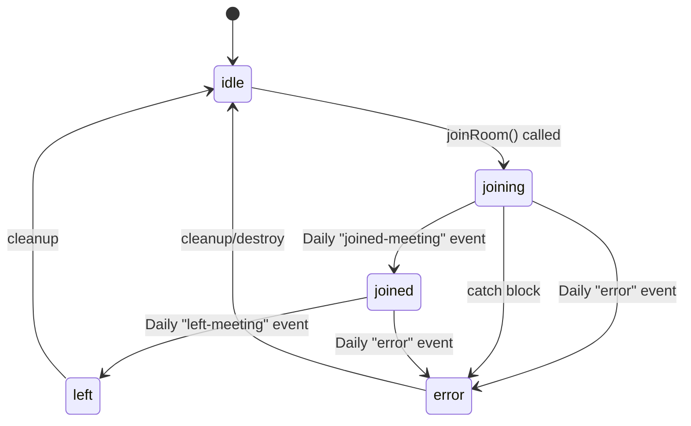
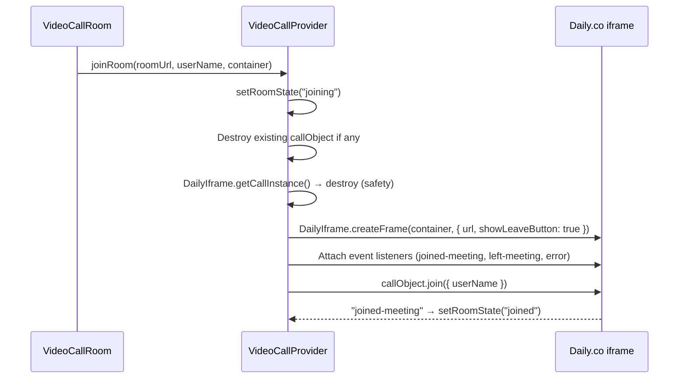
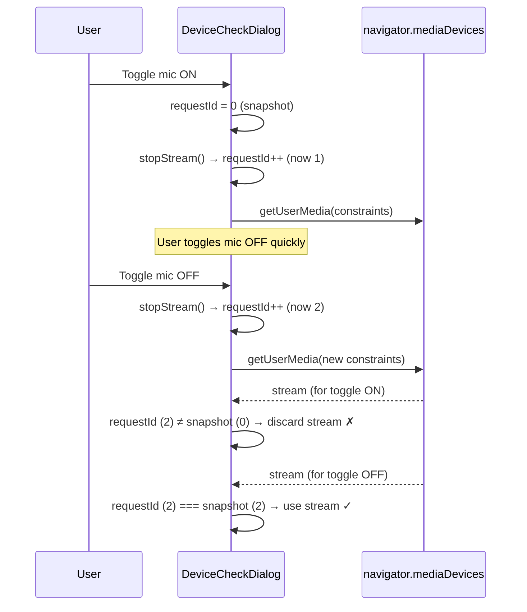

# Video Call Feature

> **Source:** `src/components/video-call/`  
> **Library:** `@daily-co/daily-js`  
> **Last Synced:** 2026-06-05

---

## 1. Overview

The video call feature uses **Daily.co** for WebRTC video conferencing. It follows a React Context pattern with iframe-based embed (`DailyIframe.createFrame`).

### Architecture

```mermaid
flowchart TD
    A[VideoCallProvider] --> B[VideoCallContext]
    B --> C[useVideoCall hook]
    C --> D[VideoCallRoom]
    C --> E[DeviceCheckDialog]

    D --> F[Daily.co iframe]
    F --> G[Pre-call lobby]
    F --> H[In-call controls]

    subgraph "State Management"
        I[roomState: idle|joining|joined|leaving|left|error]
        J[error: string | null]
        K[callObject: DailyCall]
    end
```

---

## 2. Component File Map

| File                    | Purpose                          |
| ----------------------- | -------------------------------- |
| `VideoCallContext.ts`   | TypeScript context definition    |
| `VideoCallProvider.tsx` | Daily.co lifecycle management    |
| `useVideoCall.ts`       | Context consumer hook            |
| `VideoCallRoom.tsx`     | Main room UI component           |
| `DeviceCheckDialog.tsx` | Pre-join device test dialog      |
| `VideoCallLoader.tsx`   | Loading spinner while connecting |

---

## 3. VideoCallContext

```typescript
type RoomState = "idle" | "joining" | "joined" | "leaving" | "left" | "error";

interface VideoCallContextValue {
  callObject: DailyCall | null;
  roomState: RoomState;
  error: string | null;
  joinRoom: (roomUrl: string, userName: string, container: HTMLElement) => Promise<void>;
  leaveRoom: () => Promise<void>;
}
```

---

## 4. VideoCallProvider — Lifecycle

### Room State Machine



### joinRoom Flow



### URL Normalization (`normalizeRoomUrl`)

Before creating the Daily.co iframe, `joinRoom` normalizes the room URL via a 3-tier function:

```typescript
const DAILY_URL_REGEX = /^https?:\/\//i;

function normalizeRoomUrl(rawRoomUrl: string): string | null {
  const trimmed = rawRoomUrl.trim();
  if (!trimmed) return null;

  // Tier 1: Full URL with protocol — use as-is
  if (DAILY_URL_REGEX.test(trimmed)) return trimmed;

  // Tier 2: Domain-like string (contains ".") — prepend https://
  if (trimmed.includes(".")) return `https://${trimmed}`;

  // Tier 3: Bare room name only — cannot infer Daily domain safely
  return null;
}
```

| Input                             | Tier | Output                            |
| --------------------------------- | ---- | --------------------------------- |
| `https://myorg.daily.co/room/abc` | 1    | `https://myorg.daily.co/room/abc` |
| `myorg.daily.co/room/abc`         | 2    | `https://myorg.daily.co/room/abc` |
| `abc`                             | 3    | `null` → error displayed          |
| (empty string)                    | 3    | `null` → error displayed          |

When `normalizeRoomUrl` returns `null`, `joinRoom` sets `roomState = "error"` with the message `compVideoCall.invalidMeetingRoomUrlPlease` and returns early — no iframe is created.

### Dual-Path Error Handling (`hasDailyErrorEvent`)

Daily.co errors can surface through **two separate channels** during `joinRoom`:

1. **Daily.co `"error" event`** — fired asynchronously by the iframe after `createFrame`
2. **`await callObject.join()` exception** — synchronous throw from the join call

Both paths can fire for the same underlying error. A `hasDailyErrorEvent` boolean flag prevents **double error display**:

```typescript
let hasDailyErrorEvent = false;

newCallObject.on("error", (event) => {
  hasDailyErrorEvent = true;      // Mark that Daily already reported an error
  const rawErrorMessage = extractErrorMessage(event);
  const errorMessage = isRoomUnavailableError(rawErrorMessage)
    ? t("compVideoCall.thisMeetingRoomIsNo")
    : rawErrorMessage;
  setError(errorMessage);
  setRoomState("error");
  newCallObject.destroy();
});

// ... later in the try/catch:
await newCallObject.join({ userName });
// If this throws:
catch (err) {
  if (hasDailyErrorEvent) return;  // Daily already set the specific error — don't overwrite
  // Otherwise, handle the catch-block error
}
```

```mermaid
flowchart TD
    A["callObject.join()"] --> B{join throws?}
    B -->|No| C["Wait for Daily events"]
    B -->|Yes| D{hasDailyErrorEvent?}
    D -->|Yes| E["Return silently — Daily event already set error"]
    D -->|No| F["extractErrorMessage → setError → setRoomState('error')"]
    C --> G{"Daily fires 'error' event?"}
    G -->|Yes| H["hasDailyErrorEvent = true → extractErrorMessage → setError"]
    G -->|I (joined-meeting)| I["setRoomState('joined')"]
```

### Error Message Extraction (`extractErrorMessage`)

The provider extracts user-readable messages from unknown error types using a **4-level fallback chain**:

```typescript
const extractErrorMessage = (error: unknown): string => {
  if (!error) return t("compVideoCall.anErrorOccurredWhileConnecting");
  if (typeof error === "string") return error; // Level 1: raw string
  if (error instanceof Error) return error.message; // Level 2: Error object
  if (typeof error === "object") {
    // Level 3: Daily.co event shape
    const e = error as { errorMsg?: string; error?: { msg?: string }; message?: string };
    return (
      e.errorMsg || e.error?.msg || e.message || t("compVideoCall.anErrorOccurredWhileConnecting")
    );
  }
  return t("compVideoCall.anErrorOccurredWhileConnecting"); // Level 4: i18n fallback
};
```

This handles Daily.co's inconsistent error shapes — the `"error"` event payload may be a string, an `Error` instance, or a `{ errorMsg, error: { msg, type } }` object.

### Room Unavailable Detection (`isRoomUnavailableError`)

Expired or ended rooms require a distinct user-facing message. Detection combines **literal string matching** with **i18n key matching** for multi-language support:

```typescript
const isRoomUnavailableError = (errorMessage: string): boolean => {
  const normalized = errorMessage.toLowerCase();
  return (
    normalized.includes("room is no longer available") ||
    normalized.includes(t("compVideoCall.noLongerAvailable")) ||
    normalized.includes(t("compVideoCall.expired")) ||
    normalized.includes("exp-room")
  );
};
```

The function also receives the Daily.co `event?.error?.type` field for direct type-based detection:

```typescript
const isUnavailableByType = event?.error?.type === "exp-room";
const isUnavailableByMessage = isRoomUnavailableError(rawErrorMessage);
const errorMessage =
  isUnavailableByType || isUnavailableByMessage
    ? t("compVideoCall.thisMeetingRoomIsNo")
    : rawErrorMessage;
```

This dual detection (`"exp-room"` type + translated message strings) ensures reliable detection regardless of the error message format from Daily.co.

### Cleanup

- `callObject.destroy()` on unmount via `useEffect` cleanup
- Destroy also triggered on `left-meeting` event
- Ref tracking (`callObjectRef`) prevents stale closure issues
- `leaveRoom` follows the sequence: `leave()` → `destroy()` → null refs → `setRoomState("left")`

---

## 5. VideoCallRoom Component

### Props

```typescript
interface VideoCallRoomProps {
  roomUrl: string; // Daily.co room URL
  userName: string; // Display name in call
  onLeave?: () => void; // Callback when user leaves
  onError?: (error: string) => void; // Callback on error
  onJoined?: (participantId: string) => void; // Callback when joined
  className?: string;
}
```

### Behavior

1. **Auto-join on mount**: Calls `joinRoom()` when `roomState === "idle"` and refs are ready
2. **One-shot joins**: Uses `hasStartedJoin` ref to prevent double-join
3. **One-shot joined callback**: Uses `hasCalledOnJoined` ref to fire `onJoined` once per room
4. **Leave propagation**: When `roomState === "left"`, calls `onLeave()`

### UI States

| State                      | Render                                                      |
| -------------------------- | ----------------------------------------------------------- |
| `idle` / `joining`         | Empty `<div ref={containerRef}>` (Daily iframe mounts here) |
| `joined`                   | Same div with embedded Daily.co iframe                      |
| `left`                     | "You have left the meeting" message                         |
| `error` (room unavailable) | Expired room card with Reload + Return buttons              |
| `error` (other)            | Generic error Alert with Retry + Back buttons               |

---

## 6. DeviceCheckDialog

Pre-join dialog for testing microphone and camera **before** entering the Daily.co room.

### Features

- **Device enumeration**: Lists available audio/video devices
- **Camera preview**: Live video stream in dialog
- **Mic level meter**: Real-time audio level visualization via `AudioContext` + `AnalyserNode`
- **Toggle controls**: Turn camera/mic on/off
- **Device switching**: Select specific audio/video device
- **Display name**: Optional name input

### Implementation

```typescript
interface DeviceCheckSelection {
  audioDeviceId: string | null;
  videoDeviceId: string | null;
  isMicOn: boolean;
  isCameraOn: boolean;
}
```

Uses browser `navigator.mediaDevices.getUserMedia()` directly (no Daily.co dependency).

### Stale-Request Prevention (`previewRequestIdRef`)

The dialog uses an incrementing request ID to prevent **race conditions** when the user rapidly toggles devices or switches devices. Each `startPreview` call captures a snapshot of the current ID, and checks it after every async operation:

```typescript
const previewRequestIdRef = useRef(0);

const stopStream = useCallback(() => {
  previewRequestIdRef.current += 1; // Invalidate all pending startPreview calls
  stopAudioMeter();
  // ... stop tracks, clear video ref
}, [stopAudioMeter]);

const startPreview = useCallback(
  async (mic, camera, audioId, videoId) => {
    stopStream();
    const requestId = previewRequestIdRef.current; // Snapshot current ID
    // ... getUserMedia ...
    if (requestId !== previewRequestIdRef.current) {
      stream.getTracks().forEach((track) => track.stop()); // Stale — discard
      return;
    }
    streamRef.current = stream;
    // ... attach video, start mic meter
    // Inside requestAnimationFrame loop:
    if (requestId !== previewRequestIdRef.current) return; // Stop updating
  },
  [stopStream]
);
```



### AudioContext Lifecycle

The mic level meter creates an `AudioContext` + `AnalyserNode` per preview session. Both `stopStream` and the unmount cleanup properly tear down the audio graph:

```typescript
const stopAudioMeter = useCallback(() => {
  if (animationRef.current) {
    cancelAnimationFrame(animationRef.current);
    animationRef.current = 0;
  }
  const audioContext = audioContextRef.current;
  audioContextRef.current = null;
  if (audioContext) {
    void audioContext.close().catch(() => undefined);
  }
  setMicLevel(0);
}, []);
```

The `catch(() => undefined)` silences `InvalidStateError` if the AudioContext was already closed.

### Device Enumeration & Permission Flow

On dialog open, the initialization sequence performs a **permission probe** before enumerating:

1. Request `getUserMedia({ audio: true, video: true })` to trigger browser permission prompts
2. Immediately stop the temporary stream (releases the camera/mic indicator)
3. Call `enumerateDevices()` — now returns labeled devices (without step 2, labels are empty)
4. Listen for `devicechange` events for hot-plug support

```typescript
useEffect(() => {
  if (!isOpen) return;
  let cancelled = false;
  // Reset state with setTimeout(0) — defers to after render
  const resetTimerId = window.setTimeout(() => {
    setError(null);
    setIsCameraOn(true);
    setIsMicOn(true);
    setSelectedAudioId("");
    setSelectedVideoId("");
  }, 0);
  const init = async () => {
    try {
      const tempStream = await navigator.mediaDevices.getUserMedia({ audio: true, video: true });
      tempStream.getTracks().forEach((t) => t.stop());
      await refreshDevices(); // Now returns labeled devices
    } catch {
      if (!cancelled) setError(t("..."));
    }
  };
  navigator.mediaDevices?.addEventListener?.("devicechange", handleDeviceChange);
  return () => {
    cancelled = true;
    clearTimeout(resetTimerId); /* remove listener */
  };
}, [isOpen, t]);
```

The `setTimeout(0)` defers the state reset to after the current render cycle, preventing stale UI during the dialog opening animation.

---

## 7. VideoCallLoader

Simple loading spinner displayed during connection:

```tsx
<div className="flex flex-col items-center justify-center gap-4 p-8">
  <Video className="text-muted-foreground h-16 w-16" />
  <Loader2 className="text-primary absolute -right-2 -bottom-2 h-8 w-8 animate-spin" />
  <p className="text-muted-foreground text-lg">{message ?? "Call connecting"}</p>
</div>
```

---

## 8. Integration Points

### Session Room Pages

| Page                    | Role   | Integration                               |
| ----------------------- | ------ | ----------------------------------------- |
| `SessionRoomPage`       | USER   | `<VideoCallRoom>` with mentor session URL |
| `MentorSessionRoomPage` | MENTOR | `<VideoCallRoom>` with same session URL   |

### Room URL Source

Room URLs come from the backend via the session entity:

- Session status must be `IN_PROGRESS` or similar
- URL is normalized by `normalizeRoomUrl()` (§4) to ensure `https://` prefix
- Bare room names without a domain return `null` → error displayed before iframe creation

### Double-Error Prevention

Both `VideoCallRoom` and `VideoCallProvider` independently check for room-unavailable errors:

- **VideoCallProvider** (§4): Checks `event?.error?.type === "exp-room"` + `isRoomUnavailableError()` on the raw error message
- **VideoCallRoom** (§5): Re-checks the `error` string against the same patterns to render a distinct "expired room" card with Reload + Return buttons vs. the generic error Alert

This duplication is intentional — the provider determines the error category, while the room component decides the UI rendering.

---

_Document generated from source code analysis on 2026-06-05._
